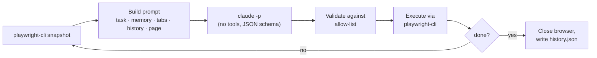

<div align="center">

# 🦆 Duckwright

[](https://github.com/locle97/duckwright/blob/main/LICENSE)
[](https://github.com/locle97/duckwright/actions/workflows/ci.yml)


**The rubber duck that drives your browser, then writes the regression test.**

A [browser-use](https://github.com/browser-use/browser-use) style agent loop built on [`playwright-cli`](https://www.npmjs.com/package/@playwright/cli) and `claude -p`.

[Features](#features) • [Getting started](#getting-started) • [Usage](#usage) • [Regression tests](#turning-a-run-into-a-regression-test) • [How it works](#how-it-works) • [Roadmap](#roadmap) • [Development](#development) • [License](#license)

</div>

Give it a task in plain English and Duckwright drives a real browser to finish it, one step at a time. The harness runs the loop, not the model: each step Claude sees the page and replies with a single structured decision. The harness checks that decision and runs it. Claude never gets a shell or any tools.

Every run also records the Playwright code behind each action, so a task the agent solved once can become a repeatable `@playwright/test` regression test.

An example run looks like this (illustrative output):

```console
$ duckwright "Go to example.com and report the page heading"
step 1 | Starting task | Open example.com | goto https://example.com → ok
step 2 | Page loaded | Read the heading | done success Example Domain → done
Result: success
Answer: Example Domain
Steps: 2  Cost: $0.0213
History: runs/20261003-101500-123456/history.json
```

## Features

- **The harness owns the loop**: snapshot, decide, validate, execute, record. The steps run in a fixed order and the browser is always closed at the end.
- **Structured decisions**: every step returns JSON that must match a schema: evaluation of the previous goal, memory, next goal, and 1 to 3 actions.
- **Commands go through an allow-list**: the decision schema restricts `cmd` to navigation and interaction commands and requires `done` to carry exactly two args, one of them `success` or `failure`. The harness checks again before running anything. Unknown commands and flags such as `--session` or `--filename` are rejected before they reach the browser.
- **Page content is treated as untrusted**: snapshots and tab titles are fenced and escaped, and the system prompt tells the model never to follow instructions found in them.
- **Built-in safeguards**: actions after a page-changing command are skipped, a `done success` is refused if an earlier action in the same step failed, repeated actions trigger a "try something different" nudge, and the run stops after repeated brain failures.
- **Full audit trail**: every run writes `history.json` with each decision, its results, and the total cost.
- **Replayable as a test**: each action in `history.json` carries the Playwright code `playwright-cli` ran for it, exported as a regression test with `duckwright export`.
- **Recorded assertions**: before finishing, the agent checks the outcome with `expect` actions. The harness verifies each check against the live page and records the passing ones as `expect(...)` lines.
- **No Python dependencies**: the runtime uses only the standard library. `pytest` is needed only for tests.

## Getting started

### Prerequisites

- [Python](https://www.python.org/downloads/) 3.11 or later
- [Node.js](https://nodejs.org/) to install the Playwright CLI:
  ```bash
  npm i -g @playwright/cli@latest
  ```
- [Claude Code](https://docs.claude.com/en/docs/claude-code) (`claude`) on your `PATH` and logged in

> [!NOTE]
> The agent uses `duckwright/prompts/playwright-cli.md`, a copy of the playwright-cli skill with the `find` and `eval` commands removed so the agent never tries them. The full skill in `.claude/skills/playwright-cli/` is for Claude Code. After updating it with `playwright-cli install --skills`, re-copy it to `duckwright/prompts/playwright-cli.md` and remove `find` and `eval` again (`tests/test_main.py` checks this).

### Install

Duckwright is not on PyPI yet, so install it from GitHub or from a local build. Each option puts a `duckwright` command on your `PATH` that works from any directory. [pipx](https://pipx.pypa.io/) keeps it in its own environment; plain `pip install` works too.

**From GitHub**, without cloning:

```bash
pipx install "git+https://github.com/locle97/duckwright.git"
```

**From a clone**:

```bash
git clone https://github.com/locle97/duckwright.git
cd duckwright
pipx install .
```

**From a wheel you build yourself**, for example to copy to another machine:

```bash
pip install build
python -m build                          # writes dist/*.whl and dist/*.tar.gz
bash scripts/smoke_install.sh dist       # optional: install check in a fresh venv, prints "smoke ok"
pipx install dist/duckwright-0.1.0-py3-none-any.whl
```

Check the install with `duckwright --version`. To pick up a newer version, re-run the same install command with `--force`. To work on the code instead, see [Development](#development).

> [!NOTE]
> **Upgrading from `pw_agent`**: the project was renamed from `pw_agent` / `playwright-agent-loop` to Duckwright. If you installed the old version, replace it with:
> ```bash
> pipx uninstall playwright-agent-loop && pipx install "git+https://github.com/locle97/duckwright.git"
> ```

## Usage

```bash
duckwright "<task>" [--max-steps N] [--model M] [--[no-]headed]
                  [--skill PATH] [--session NAME] [--state FILE]
                  [--allow-file-access] [--[no-]export]
duckwright -f FILE [options]
duckwright export RUN [-o FILE]
```

`python3 -m duckwright` works the same way. Run `duckwright --version` to print the installed version. Runs are written to `runs/` in the current directory, which is created if it does not exist.

| Option | Default | Description |
| --- | --- | --- |
| `-f`, `--file` | none | Read the task, and optional settings, from a [task file](#task-files) instead of the command line |
| `--max-steps` | `25` | Maximum number of loop iterations |
| `--model` | `sonnet` | Model passed to `claude -p --model` |
| `--headed` | off | Show the browser window (`--no-headed` overrides a task file) |
| `--skill` | bundled `duckwright/prompts/playwright-cli.md` | Path to the playwright-cli skill appended to the system prompt |
| `--session` | `duckwright` | playwright-cli session name |
| `--state` | none | Storage state JSON loaded with `playwright-cli state-load` before the first step, for pages that need a login |
| `--allow-file-access` | off | Allow `file://` URLs, which playwright-cli blocks by default |
| `--export` | off | After a successful run, write a Playwright test to `runs/<id>/duckwright.spec.ts` (see [Regression tests](#turning-a-run-into-a-regression-test)); `--no-export` overrides a task file |

> [!NOTE]
> When the first argument is exactly `export`, it is read as the `export` subcommand. Any longer task, such as `"export my report"`, runs normally; to run a task that is only the word `export`, write `duckwright -- export`.

> [!IMPORTANT]
> Two runs at the same time must use different `--session` names. Otherwise they drive the same browser.

> [!WARNING]
> `--allow-file-access` gives the browser unrestricted access to local files, not just one file. A page that hijacks the agent could `goto file:///home/you/.ssh/...` and leak the contents. Only use it with trusted pages and trusted tasks. The flag only applies when the session's browser is first opened, so close any existing session first.

### Authenticated pages

Log in once in a headed session and save the storage state (cookies and localStorage), then pass it with `--state`:

```bash
playwright-cli -s=login open https://app.example.com/login --headed
# log in by hand in the browser window, then:
playwright-cli -s=login state-save auth.json
playwright-cli -s=login close

duckwright "Open https://app.example.com/settings and report my plan" --state auth.json
```

> [!CAUTION]
> `auth.json` holds live session tokens. Keep it out of git, and remember the agent can act as you on every site in the file.

### Task files

A task can live in a file instead of on the command line, so you can keep it, review it and re-run it without shell quoting:

```bash
duckwright -f tasks/greet.md
```

The file is the task text, optionally preceded by front matter with the run's settings. `.txt`, `.md` and any other extension are read the same way:

```md
---
model: opus
max-steps: 15
state: auth.json
export: true
---
Open https://example.com/form, enter the name Linh, submit,
and check the greeting says "Hello, Linh!".
```

| Key | Value |
| --- | --- |
| `max-steps` | a whole number of at least 1 |
| `model` | text |
| `headed` | `true` or `false` |
| `skill` | a path |
| `session` | text |
| `state` | a path |
| `export` | `true` or `false` |

- Front matter starts with `---` on the first line and ends at the next `---` line. Each line inside is a flat `key: value`; lines starting with `#` and text after ` #` are comments. Quote a value to keep a `#` in it.
- Flags on the command line override the file, for example `--max-steps 5` or `--no-export`.
- Relative `skill` and `state` paths are resolved from the file's folder, not the current directory.
- `allow-file-access` can only be given on the command line, so a shared task file can never turn it on.
- Give either a task or `-f`, not both. A missing or invalid file prints the file, the line and the problem, and exits with `2` before anything runs.

[`examples/task.md`](https://github.com/locle97/duckwright/blob/main/examples/task.md) is a commented template to copy.

### Output

Each step's history line is printed as it happens, followed by the result, answer, step count, and cost. Each run gets its own directory, `runs/<timestamp>-<microseconds>/`, which contains:

- `snapshot.yml`: the latest accessibility snapshot of the page
- `history.json`: the task, the task file it came from (`task_file`, `null` for a task given on the command line), the outcome, the total cost, and every step's decision and results. Each action also records the Playwright `code` that `playwright-cli` ran for it (`null` when the action was rejected, skipped, failed, timed out, was `done`, or printed no code; a timed-out `goto` may still have navigated). For an `expect` action that passed, `code` is the assertion line, such as `await expect(page.getByText('Hello, Linh!')).toHaveText("Hello, Linh!");`.

- `duckwright.spec.ts`: the generated regression test, only with `--export`

> [!CAUTION]
> `code` contains whatever the agent typed, passwords included. Treat `history.json` and any exported spec like `auth.json`.

### Exit codes

| Code | Meaning |
| --- | --- |
| `0` | The agent finished with `done success` |
| `1` | Failure: `done failure`, max steps reached, repeated brain failures, or a playwright error |
| `2` | Bad input or a preflight check failed: an unreadable or invalid task file, a missing system prompt, skill, `--state` file, `claude`, or `playwright-cli` |
| `130` | Interrupted with Ctrl-C (`history.json` is still written) |

## Turning a run into a regression test

A successful run already contains the steps of a Node.js `@playwright/test` test, so you don't need to drive the agent again:

1. Export it, either afterwards or as part of the run:
   ```bash
   duckwright export runs/<id>                      # writes runs/<id>/duckwright.spec.ts
   duckwright export runs/<id> -o e2e/greet.spec.ts # or anywhere else
   duckwright "<task>" --export                     # export right after a successful run
   ```
   The test contains each action's recorded `code` in step order, including the assertions the agent checked with `expect`, using the semantic locators `playwright-cli` generates:
   ```ts
   // Generated by duckwright from history.json. Review before committing:
   // recorded code contains everything the agent typed, passwords included.
   import { test, expect } from '@playwright/test';

   test("Fill in the form with the name Linh and check the greeting", async ({ page }) => {
     await page.goto('https://example.com/form');
     await page.getByRole('textbox', { name: 'Name' }).fill('Linh');
     await page.getByRole('button', { name: 'Submit' }).click();
     await expect(page.getByText('Hello, Linh!')).toHaveText("Hello, Linh!");
   });
   ```
   Expected values in recorded assertions are always written in double quotes; that is intended. Screenshots are left out. If the agent recorded no assertions, the export prints a warning.
2. Add any further assertions the agent did not record.
3. Run it with `npx playwright test` and fix any locator that fails. [`test-generation.md`](https://github.com/locle97/duckwright/blob/main/.claude/skills/playwright-cli/references/test-generation.md) in the playwright-cli skill covers that workflow.

Only successful runs can be exported. `duckwright export` exits with `0` when the test was written, `1` when it refused (the run did not succeed, or it recorded no Playwright code), and `2` when the path or `history.json` cannot be used. With `--export`, a failed export is reported on stderr but does not change the run's exit code.

> [!IMPORTANT]
> Some setup leaves no `code` behind. If the run used `--state FILE`, load the same state in the test with `test.use({ storageState: 'auth.json' })`. If it used `tab-new`, `tab-select` or `tab-close`, the export marks the spot with a `// TODO(duckwright)` line and prints a warning: edit that part by hand, because the test assumes a single `page`.

## How it works



1. **Observe**: the harness lists the open tabs and takes an accessibility snapshot. Snapshots longer than 40k characters are truncated.
2. **Decide**: `claude -p` runs with all tools, MCP servers, and slash commands disabled. It gets [`duckwright/prompts/system.md`](https://github.com/locle97/duckwright/blob/main/duckwright/prompts/system.md) plus the playwright-cli skill as its system prompt and must return output that matches the decision schema.
3. **Validate and execute**: each action is checked against the allowed commands (`goto`, `click`, `fill`, `type`, `press`, `select`, `check`, `uncheck`, `hover`, `drag`, `tab-new`, `tab-select`, `tab-close`, `go-back`, `screenshot`, `expect`, `done`) and their allowed flags, then run through `playwright-cli`. `expect` is handled by the harness: it gets a locator for the ref with `playwright-cli generate-locator`, reads the element's state, and compares it with the expected value. Actions after a page-changing command are skipped, because element refs may no longer be valid.
4. **Record**: the step is added to the history as one compact line, together with the Playwright code each action ran. The last 15 lines are included in the next prompt; the code is not.

The loop ends when the model sends a `done` action, when max steps is reached, or after 3 consecutive brain failures.

| Module | Responsibility |
| --- | --- |
| [`loop.py`](https://github.com/locle97/duckwright/blob/main/duckwright/loop.py) | The agent loop, repeat detection, and failure handling |
| [`brain.py`](https://github.com/locle97/duckwright/blob/main/duckwright/brain.py) | Calls `claude -p`, enforces the decision schema, tracks cost |
| [`actions.py`](https://github.com/locle97/duckwright/blob/main/duckwright/actions.py) | Command and flag allow-lists, action execution, Playwright code capture |
| [`export.py`](https://github.com/locle97/duckwright/blob/main/duckwright/export.py) | Renders `history.json` as a `@playwright/test` spec |
| [`expect.py`](https://github.com/locle97/duckwright/blob/main/duckwright/expect.py) | `expect` checks: verified against the live page and recorded as assertions |
| [`taskfile.py`](https://github.com/locle97/duckwright/blob/main/duckwright/taskfile.py) | Reads task files: front-matter settings and the task text |
| [`observe.py`](https://github.com/locle97/duckwright/blob/main/duckwright/observe.py) | Tab list and page snapshot |
| [`prompt.py`](https://github.com/locle97/duckwright/blob/main/duckwright/prompt.py) | Prompt sections, history lines, escaping untrusted content |
| [`pw.py`](https://github.com/locle97/duckwright/blob/main/duckwright/pw.py) | `playwright-cli` wrapper |

## Roadmap

Planned work, in no particular order. Nothing here is scheduled yet.

**Test generation**

- [x] **Automatic test export**: `duckwright export runs/<id>`, or `--export` on a run, writes a ready-to-run `.spec.ts` from `history.json`, replacing the manual [regression test](#turning-a-run-into-a-regression-test) steps.
- [x] **Agent-recorded assertions**: an `expect` action, so the checks the agent makes become `expect(...)` lines instead of being written by hand from `answer`.
- [ ] **Multi-tab and storage state in exports**: generate code for `tab-*` commands and `--state` runs, the two cases that currently need hand edits.

**Reliability and cost**

- [ ] **Replay mode**: re-run the recorded code first and call the agent only when a step breaks, so a changed locator heals itself.
- [ ] **Cost budget**: a `--max-cost` limit that stops the run once spend exceeds it, alongside `--max-steps`.
- [ ] **Jev backend (`--jev`)**: a cheaper brain using [TypeSafe's Jev](https://typesafe.ai/) model. Jev returns typed choices with calibrated confidence but no free text. So it would pick the command and the element ref each step, and pass anything that needs text (URLs, form input, the final answer) or has low confidence to Claude.

**Safety**

- [ ] **Secret redaction**: mask passwords and other sensitive input in `history.json`, so it no longer has to be handled like `auth.json`.
- [ ] **Domain allow-list**: restrict `goto` and navigation to approved hosts.

**Experience**

- [ ] **TUI**: an interactive terminal UI that shows each step's goal, actions, results, and running cost live, with keys to pause, step through, or stop the run.
- [ ] **Batch runs**: run many tasks from a file, each in its own session.
- [x] **Packaging**: a console-script entry point, so `duckwright` runs from any directory after a local or GitHub install.
- [ ] **PyPI release**: publish `duckwright` so `pipx install duckwright` works. The `release.yml` workflow is ready; it needs a PyPI trusted publisher first.

## Development

```bash
git clone https://github.com/locle97/duckwright.git
cd duckwright
pip install -e ".[dev]"
python3 -m pytest                                          # unit tests
DUCKWRIGHT_E2E=1 python3 -m pytest tests/test_e2e.py -v -s   # live e2e: real claude + headless browser
```

> [!NOTE]
> If your clone predates the rename to Duckwright, delete any old `*.egg-info` directory and re-run `pip install -e ".[dev]"` once. Otherwise `duckwright --version` prints `unknown`.

> [!TIP]
> The e2e test fills in and submits [`tests/fixtures/form.html`](https://github.com/locle97/duckwright/blob/main/tests/fixtures/form.html) using a real model, so each run costs a small amount.

CI runs the unit tests on Python 3.11, 3.12, and 3.13 for every push to `main` and every pull request. A `package` job also builds the wheel and smoke-tests it in a fresh venv.

Releasing to PyPI (not set up yet): add a trusted publisher on PyPI for `release.yml` with environment `pypi`, bump `version` in `pyproject.toml`, merge, then push tag `vX.Y.Z`. `release.yml` runs the tests and the install check, then publishes.

## License

[MIT](https://github.com/locle97/duckwright/blob/main/LICENSE).

`duckwright/prompts/playwright-cli.md` and `.claude/skills/playwright-cli/` are adapted from the skill shipped with Microsoft's [`@playwright/cli`](https://www.npmjs.com/package/@playwright/cli), which is licensed under Apache-2.0.

Duckwright is not affiliated with Microsoft or the Playwright project.
