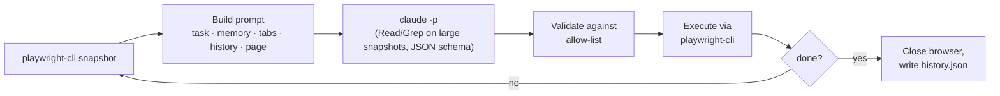

<div align="center">

# 🦆 Duckwright

[](https://github.com/locle97/duckwright/blob/main/LICENSE)
[](https://github.com/locle97/duckwright/actions/workflows/ci.yml)


**The rubber duck that drives your browser, then writes the regression test.**

A [browser-use](https://github.com/browser-use/browser-use) style agent loop built on [`playwright-cli`](https://www.npmjs.com/package/@playwright/cli) and `claude -p`.

[Features](#features) • [Getting started](#getting-started) • [Usage](#usage) • [Regression tests](#turning-a-run-into-a-regression-test) • [How it works](#how-it-works) • [Roadmap](#roadmap) • [Development](#development) • [License](#license)

</div>

Give it a task in plain English and Duckwright drives a real browser to finish it, one step at a time. The harness runs the loop, not the model: each step Claude sees the page and replies with a single structured decision. The harness checks that decision and runs it. Claude never gets a shell. Small pages are pasted into the prompt and Claude gets no tools. For larger pages its only tools are Read and Grep, limited to the folder that holds the page snapshot.

Every run also records the Playwright code behind each action, so a task the agent solved once can become a repeatable `@playwright/test` regression test.

An example run looks like this (illustrative output):

```console
$ duckwright "Go to example.com and report the page heading"
step 1 | Starting task | Open example.com | goto https://example.com → ok
step 2 | Page loaded | Read the heading | done success Example Domain → done
Result: success
Answer: Example Domain
Steps: 2  Cost: $0.0213
History: runs/20261003-101500-brave-otter/history.json
```

## Features

- **The harness owns the loop**: snapshot, decide, validate, execute, record. The steps run in a fixed order and the browser is always closed at the end.
- **Structured decisions**: every step returns JSON that must match a schema: evaluation of the previous goal, memory, next goal, and 1 to 3 actions.
- **Commands go through an allow-list**: the decision schema restricts `cmd` to navigation and interaction commands and requires `done` to carry exactly two args, one of them `success` or `failure`. The harness checks again before running anything. Unknown commands and flags such as `--session` or `--filename` are rejected before they reach the browser.
- **Page content is treated as untrusted**: snapshots and tab titles are fenced and escaped, and the system prompt tells the model never to follow instructions found in them, including in what it reads from `snapshot.yml`.
- **Large snapshots are searched, not pasted**: by default a page snapshot of up to 5,000 characters is pasted into the prompt. A larger one is saved to a file that Claude greps for what it needs, instead of receiving up to 40k characters. `--snapshot-full` and `--snapshot-grep` force one way or the other.
- **Built-in safeguards**: actions after a page-changing command are skipped, a `done success` is refused if an earlier action in the same step failed, repeated actions trigger a "try something different" nudge, and the run stops after repeated brain failures.
- **Full audit trail**: every run writes `history.json` with each decision, its results, and the total cost.
- **Replayable as a test**: each action in `history.json` carries the Playwright code `playwright-cli` ran for it, exported as a regression test with `duckwright export`.
- **Recorded assertions**: before finishing, the agent checks the outcome with `expect` actions. The harness verifies each check against the live page and records the passing ones as `expect(...)` lines.
- **Minimal dependencies**: the core loop uses only Node's standard library; `--tui` uses Ink. TypeScript and the test tools are development dependencies.

## Getting started

### Prerequisites

- [Node.js](https://nodejs.org/) 22.18 or later, which also installs the Playwright CLI:
  ```bash
  npm i -g @playwright/cli@latest
  ```
- [Claude Code](https://docs.claude.com/en/docs/claude-code) (`claude`) on your `PATH` and logged in. The default `--snapshot-hybrid` mode and `--snapshot-grep` need a version with the `--restricted` option (tested with 2.1.288); `--snapshot-full` also works with older versions

> [!NOTE]
> The agent uses `prompts/playwright-cli.md`, a copy of the playwright-cli skill with the `find` and `eval` commands removed so the agent never tries them. The full skill in `.claude/skills/playwright-cli/` is for Claude Code. After updating it with `playwright-cli install --skills`, re-copy it to `prompts/playwright-cli.md` and remove `find` and `eval` again (`test/cli.test.ts` checks this).

### Install

Each option puts a `duckwright` command on your `PATH` that works from any directory.

**From npm**:

```bash
npm install -g duckwright
```

**From a clone**:

```bash
git clone https://github.com/locle97/duckwright.git
cd duckwright
npm install                              # also builds dist/
npm install -g .
```

**From a tarball you build yourself**, for example to copy to another machine:

```bash
npm install
npm pack                                 # writes duckwright-0.1.0.tgz
bash scripts/smoke_install.sh            # optional: install check in a temporary prefix, prints "smoke ok"
npm install -g ./duckwright-0.1.0.tgz
```

Installing straight from GitHub (`npm install -g github:locle97/duckwright`) does not work: npm builds git dependencies in a nested install that does not get the package's devDependencies, so the build fails with `tsc: not found`.

Check the install with `duckwright --version`. To pick up a newer version, re-run the same install command. To work on the code instead, see [Development](#development).

> [!NOTE]
> **Upgrading from the Python version**: Duckwright was rewritten in TypeScript; the commands, task files and `history.json` are unchanged. If you installed it with pipx, remove that copy first with `pipx uninstall duckwright`. The Python code is kept, frozen, in [`legacy/`](https://github.com/locle97/duckwright/tree/main/legacy).

> [!NOTE]
> **Upgrading from `pw_agent`**: the project was renamed from `pw_agent` / `playwright-agent-loop` to Duckwright. If you installed the old version, replace it with:
> ```bash
> pipx uninstall playwright-agent-loop && npm install -g duckwright
> ```

## Usage

```bash
duckwright "<task>" [--max-steps N] [--model M] [--[no-]headed]
                  [--skill PATH] [--session NAME] [--state FILE]
                  [--allow-file-access] [--[no-]export] [--[no-]network]
duckwright -f FILE|FOLDER [FILE|FOLDER ...] [options]
duckwright export RUN [-o FILE]
duckwright --tui [--max-parallel N] [--past N] [--theme NAME] [options]
```

Run `duckwright --version` to print the installed version. Runs are written to `runs/` in the current directory, which is created if it does not exist.

| Option | Default | Description |
| --- | --- | --- |
| `-f`, `--file` | none | Read the task, and optional settings, from a [task file](#task-files) instead of the command line. Takes one or more files or folders; several make a [batch](#batch-runs) |
| `--max-steps` | `25` | Maximum number of loop iterations |
| `--model` | `sonnet` | Model passed to `claude -p --model` |
| `--headed` | off | Show the browser window (`--no-headed` overrides a task file) |
| `--skill` | bundled `prompts/playwright-cli.md` | Path to the playwright-cli skill appended to the system prompt |
| `--session` | `duckwright` | playwright-cli session name |
| `--state` | none | Storage state JSON loaded with `playwright-cli state-load` before the first step, for pages that need a login |
| `--allow-file-access` | off | Allow `file://` URLs, which playwright-cli blocks by default |
| `--export` | off | After a successful run, write a Playwright test to `runs/<id>/duckwright.spec.ts` (see [Regression tests](#turning-a-run-into-a-regression-test)); `--no-export` overrides a task file |
| `--network` | on | Record the API calls the page makes each step, redacted, under `runs/<id>/network/` (see [Output](#output)); `--no-network` turns it off or overrides a task file |
| `--tui` | off | Open the [interactive TUI](#interactive-tui) instead of running one task. Tasks are typed or `@`-mentioned inside it, so it takes no task or `--file`, and it needs a terminal |
| `--max-parallel` | `3` | With `--tui`, how many runs may be active at once |
| `--past` | `20` | With `--tui`, how many of the newest past runs from `runs/` to show in the sidebar; `0` shows none |
| `--theme` | `auto` | With `--tui`, the colour theme: `auto`, `dark`, or `light` |
| `--snapshot-hybrid` | on | Paste page snapshots of up to 5,000 characters into the prompt; for larger ones, let Claude grep the saved file. Decided again every step (see [Reading the page](#reading-the-page)) |
| `--snapshot-full` | off | Always paste the page snapshot into the prompt, truncated at 40k characters. Claude gets no tools |
| `--snapshot-grep` | off | Never paste the page snapshot: Claude always greps the saved file |

> [!NOTE]
> When the first argument is exactly `export`, it is read as the `export` subcommand. Any longer task, such as `"export my report"`, runs normally; to run a task that is only the word `export`, write `duckwright -- export`.

> [!IMPORTANT]
> Two runs at the same time must use different `--session` names. Otherwise they drive the same browser. The same goes for two TUIs: give each its own `--session`. Inside one TUI, runs get their own sessions automatically.

> [!WARNING]
> `--allow-file-access` gives the browser unrestricted access to local files, not just one file. A page that hijacks the agent could `goto file:///home/you/.ssh/...` and leak the contents. Only use it with trusted pages and trusted tasks. The flag only applies when the session's browser is first opened, so close any existing session first.

### Interactive TUI

`duckwright --tui` opens a workspace in the terminal. You queue tasks, start several at once, and watch each step's goal, actions, results, and running cost live. Pass the usual options (`--model`, `--max-steps`, ...) as defaults for every task, and `--max-parallel N` to cap concurrent runs.

**Global options.** The lower pane of the left column shows the global options (model, max steps, headed, export, snapshot mode). `h` or `l` moves the focus between it and the task list; there, `j`/`k` pick a field and `⏎` edits it in place (`O` edits them from anywhere). They apply to every task's next run, above the command-line flags and below a task's own `o` options.

**Past runs.** Runs saved in `runs/` appear in the sidebar with a muted name, newest `--past N` of them (default 20). They are read-only: select one to see its timeline, and press `space` to run it again with the current flags.

**Network calls.** With network capture on (the default), expand a step (`⏎`, or `e` for all steps) to see the calls it made: method, URL, status and time, with failures in red. A step lists up to 8 calls, then `…and N more`. The full request and response files stay under `runs/<id>/network/`.

**Filter.** Press `/` and type to narrow the sidebar by task name. `⏎` keeps the filter, `esc` clears it.

**Themes.** `--theme auto` picks dark or light from `COLORFGBG`; `COLORTERM=truecolor` enables the full-colour palette. With `NO_COLOR` set, no colours are used and the focused pane gets a bold border instead.

Six keys to learn first:

| Key | Does |
| --- | --- |
| `a` | Add a task |
| `space` | Start the selected task |
| `⏎` | Show the selected task's details |
| `p` | Pause or resume it |
| `s` | Stop it |
| `q` | Quit (asks first if runs are active) |

Press `?` inside the TUI for the rest.

In the add box, `@` mentions task files: `@tasks/login.md` adds that file, and `@tasks/smoke/` adds every task file at the folder's root. Their front matter applies, as with `-f`, except `session:`, because each run gets its own browser session. Any text left over becomes one typed task:

```text
› @tasks/smoke/ @tasks/login.md Check the footer links
```

A completion list opens as you type after `@`. `tab` completes (going into a folder), and `⏎` accepts. Write a path with spaces as `@"my tasks/a.md"`, and `\@` for a literal `@`. If any mention fails (a missing file, a folder with no task files, bad front matter), nothing from that line is added and the errors show under the box.

### Authenticated pages

Log in once in a headed session and save the storage state (cookies and localStorage), then pass it with `--state`:

```bash
playwright-cli -s=login open https://app.example.com/login --headed
# log in by hand in the browser window, then:
playwright-cli -s=login state-save auth.json
playwright-cli -s=login close

duckwright "Open https://app.example.com/settings and report my plan" --state auth.json
```

> [!CAUTION]
> `auth.json` holds live session tokens. Keep it out of git, and remember the agent can act as you on every site in the file.

### Task files

A task can live in a file instead of on the command line, so you can keep it, review it and re-run it without shell quoting:

```bash
duckwright -f tasks/greet.md
```

The file is the task text, optionally preceded by front matter with the run's settings. `.txt`, `.md` and any other extension are read the same way:

```md
---
model: opus
max-steps: 15
state: auth.json
export: true
---
Open https://example.com/form, enter the name Linh, submit,
and check the greeting says "Hello, Linh!".
```

| Key | Value |
| --- | --- |
| `max-steps` | a whole number of at least 1 |
| `model` | text |
| `headed` | `true` or `false` |
| `skill` | a path |
| `session` | text |
| `state` | a path |
| `export` | `true` or `false` |
| `network` | `true` or `false` |
| `snapshot` | `hybrid`, `full` or `grep` |

- Front matter starts with `---` on the first line and ends at the next `---` line. Each line inside is a flat `key: value`; lines starting with `#` and text after ` #` are comments. Quote a value to keep a `#` in it.
- Flags on the command line override the file, for example `--max-steps 5` or `--no-export`.
- Relative `skill` and `state` paths are resolved from the file's folder, not the current directory.
- `allow-file-access` can only be given on the command line, so a shared task file can never turn it on.
- Give either a task or `-f`, not both. A missing or invalid file prints the file, the line where there is one, and the problem, and exits with `2` before anything runs.

[`examples/task.md`](https://github.com/locle97/duckwright/blob/main/examples/task.md) is a commented template to copy.

#### Batch runs

Give `-f` several files, or a folder, to run them one after another:

```bash
duckwright -f tasks/login.md tasks/greet.md   # several files
duckwright -f tasks/*.md                       # shell glob
duckwright -f tasks/                           # every task file at the folder's root
duckwright -f tasks/ extra/one.md --headed     # mixed; flags apply to every task
```

- A folder runs its `.md` and `.txt` files (any case), sorted by name. Only the top level is read: subfolders, hidden files and other files, such as an `auth.json` next to the tasks, are ignored. A file reached twice runs once.
- Every file is loaded and preflight-checked before anything runs. If any is invalid, every problem is printed and nothing runs (exit `2`).
- Each task uses its own file's settings; flags on the command line apply to every task and still win.
- Tasks run in order, each in its own `runs/<id>/` folder, preceded by a `[1/3] tasks/a.md` line. A failing task does not stop the batch; Ctrl-C does, and the remaining tasks are not run.
- A summary follows the last task:

  ```
  Batch: 2 passed, 1 failed, 0 not run  Cost: $0.4120
  pass  tasks/a.md  $0.1467  runs/20261003-101500-a/history.json
  fail  tasks/b.md  $0.2121  runs/20261003-101530-b/history.json
  pass  tasks/c.md  $0.0532  runs/20261003-101612-c/history.json
  ```

  Each line is `pass`, `fail`, `stop` (interrupted) or `skip` (not run), then what that task cost and its `history.json`. The first line totals the cost of the whole batch, counting money spent by tasks that failed, crashed or were interrupted.
- When the paths come down to a single file, the run is an ordinary single run, with no summary.
- `-f` reads every argument after it as a path, so `duckwright -f a.md "Open the site"` fails with `Open the site: file not found`. A task on the command line and `-f` cannot be combined anyway.

### Output

Each step's history line is printed as it happens, followed by the result, answer, step count, and cost. Each run gets its own directory, `runs/<timestamp>-<label>/`, such as `runs/20261003-101500-login/`. The label is the task file's name without its extension (lowercased, accents dropped, anything but letters and digits turned into `-`, at most 40 characters), or two random words such as `brave-otter` for a task given on the command line or a file name with no usable characters. A run that would reuse an existing name gets `-2`, `-3` and so on. The directory contains:

- `page/snapshot.yml`: the latest accessibility snapshot of the page
- `history.json`: the task, the task file it came from (`task_file`, `null` for a task given on the command line), the outcome, the total cost, and every step's decision and results. Each action also records the Playwright `code` that `playwright-cli` ran for it (`null` when the action was rejected, skipped, failed, timed out, was `done`, or printed no code; a timed-out `goto` may still have navigated). For an `expect` action that passed, `code` is the assertion line, such as `await expect(page.getByText('Hello, Linh!')).toHaveText("Hello, Linh!");`.
- `network/<request id>/`: with network capture on (the default), one folder per captured API call, numbered `0001`, `0002`, … across the run. It holds `request.json` (id, step, method, redacted URL and headers), `response.json` (status, status text, type, MIME type, duration and redacted headers), and, only when non-empty, `request-body.txt` and `response-body.txt` (redacted) or `response-body.bin` (a binary response, copied unredacted). Nothing is created with `--no-network`.
- `events.jsonl`: every run event, one JSON object per line
- `duckwright.spec.ts`: the generated regression test, only with `--export`

> [!CAUTION]
> `code` contains whatever the agent typed, passwords included. Treat `history.json` and any exported spec like `auth.json`.

> [!CAUTION]
> Redaction of captured network data is pattern-based (secret-named headers, secret-named keys in JSON, form and URL query data, and Bearer/Basic credentials). Captured bodies can still hold secrets it misses, and binary response bodies are not redacted at all. Treat `network/` like `history.json`.

**Network capture.** After each step that ran actions, Duckwright reads the page's requests through `playwright-cli`, redacts them in memory (secrets become a literal `[REDACTED]`), and writes them to `network/`. Each such step in `history.json` gains a `network` array of entries (`id`, `method`, `url`, `status`, `statusText`, `type`, `durationMs`), and, if something went wrong while capturing or clearing the request list, a `network_errors` array of messages. Steps where the brain failed have neither key. The next prompt shows the agent a short `<network>` summary of its last step's calls. Capture errors never change the run's outcome or exit code.

Limits:

- Only the current tab since its last page load is captured. Calls lost to a navigation in the middle of a step, or made in other tabs, are not recorded.
- If clearing the request list fails after a step, the next step may list the same calls again.
- A binary request body (an upload) is recorded as whatever `playwright-cli` prints for it, which may not be the real bytes.

### Exit codes

| Code | Meaning |
| --- | --- |
| `0` | The agent finished with `done success` |
| `1` | Failure: `done failure`, max steps reached, repeated brain failures, or a playwright error. In a batch, at least one task failed |
| `2` | Bad input or a preflight check failed: an unreadable or invalid task file, a folder with no task files, a missing system prompt, skill, `--state` file, `claude`, or `playwright-cli` |
| `130` | Interrupted with Ctrl-C (`history.json` is still written; a batch stops at the interrupted task) |

## Turning a run into a regression test

A successful run already contains the steps of a Node.js `@playwright/test` test, so you don't need to drive the agent again:

1. Export it, either afterwards or as part of the run:
   ```bash
   duckwright export runs/<id>                      # writes runs/<id>/duckwright.spec.ts
   duckwright export runs/<id> -o e2e/greet.spec.ts # or anywhere else
   duckwright "<task>" --export                     # export right after a successful run
   ```
   The test contains each action's recorded `code` in step order, including the assertions the agent checked with `expect`, using the semantic locators `playwright-cli` generates:
   ```ts
   // Generated by duckwright from history.json. Review before committing:
   // recorded code contains everything the agent typed, passwords included.
   import { test, expect } from '@playwright/test';

   test("Fill in the form with the name Linh and check the greeting", async ({ page }) => {
     await page.goto('https://example.com/form');
     await page.getByRole('textbox', { name: 'Name' }).fill('Linh');
     await page.getByRole('button', { name: 'Submit' }).click();
     await expect(page.getByText('Hello, Linh!')).toHaveText("Hello, Linh!");
   });
   ```
   Expected values in recorded assertions are always written in double quotes; that is intended. Screenshots are left out. If the agent recorded no assertions, the export prints a warning.
2. Add any further assertions the agent did not record.
3. Run it with `npx playwright test` and fix any locator that fails. [`test-generation.md`](https://github.com/locle97/duckwright/blob/main/.claude/skills/playwright-cli/references/test-generation.md) in the playwright-cli skill covers that workflow.

Only successful runs can be exported. `duckwright export` exits with `0` when the test was written, `1` when it refused (the run did not succeed, or it recorded no Playwright code), and `2` when the path or `history.json` cannot be used. With `--export`, a failed export is reported on stderr but does not change the run's exit code.

> [!IMPORTANT]
> Some setup leaves no `code` behind. If the run used `--state FILE`, load the same state in the test with `test.use({ storageState: 'auth.json' })`. If it used `tab-new`, `tab-select` or `tab-close`, the export marks the spot with a `// TODO(duckwright)` line and prints a warning: edit that part by hand, because the test assumes a single `page`.

## How it works



1. **Observe**: the harness lists the open tabs and saves an accessibility snapshot to `page/snapshot.yml`. The snapshot is then either pasted into the prompt or named there with its size for Claude to search; see [Reading the page](#reading-the-page).
2. **Decide**: when the snapshot is pasted, `claude -p` gets no tools. Otherwise it runs in the `page/` folder with only the Read and Grep tools and `--restricted`, which keeps them inside that folder. MCP servers and slash commands are always disabled. It gets [`prompts/system.md`](https://github.com/locle97/duckwright/blob/main/prompts/system.md), the prompt for its reading mode (`snapshot-hybrid.md`, `snapshot-full.md` or `snapshot-grep.md`), and the playwright-cli skill as its system prompt, and must return output that matches the decision schema.
3. **Validate and execute**: each action is checked against the allowed commands (`goto`, `click`, `fill`, `type`, `press`, `select`, `check`, `uncheck`, `hover`, `drag`, `tab-new`, `tab-select`, `tab-close`, `go-back`, `screenshot`, `expect`, `done`) and their allowed flags, then run through `playwright-cli`. `expect` is handled by the harness: it gets a locator for the ref with `playwright-cli generate-locator`, reads the element's state, and compares it with the expected value. Actions after a page-changing command are skipped, because element refs may no longer be valid.
4. **Record**: the step is added to the history as one compact line, together with the Playwright code each action ran. The last 15 lines are included in the next prompt; the code is not.

The loop ends when the model sends a `done` action, when max steps is reached, or after 3 consecutive brain failures.

| Module | Responsibility |
| --- | --- |
| [`loop.ts`](https://github.com/locle97/duckwright/blob/main/src/loop.ts) | The agent loop, repeat detection, and failure handling |
| [`brain.ts`](https://github.com/locle97/duckwright/blob/main/src/brain.ts) | Calls `claude -p`, enforces the decision schema, tracks cost |
| [`actions.ts`](https://github.com/locle97/duckwright/blob/main/src/actions.ts) | Command and flag allow-lists, action execution, Playwright code capture |
| [`export.ts`](https://github.com/locle97/duckwright/blob/main/src/export.ts) | Renders `history.json` as a `@playwright/test` spec |
| [`expect.ts`](https://github.com/locle97/duckwright/blob/main/src/expect.ts) | `expect` checks: verified against the live page and recorded as assertions |
| [`taskfile.ts`](https://github.com/locle97/duckwright/blob/main/src/taskfile.ts) | Reads task files (front-matter settings and the task text) and expands task folders for batch runs |
| [`observe.ts`](https://github.com/locle97/duckwright/blob/main/src/observe.ts) | Tab list and page snapshot |
| [`prompt.ts`](https://github.com/locle97/duckwright/blob/main/src/prompt.ts) | Prompt sections, history lines, escaping untrusted content |
| [`pw.ts`](https://github.com/locle97/duckwright/blob/main/src/pw.ts) | `playwright-cli` wrapper |
| [`proc.ts`](https://github.com/locle97/duckwright/blob/main/src/proc.ts) | Runs `claude` and `playwright-cli` as child processes, with a timeout and Ctrl-C stopping them |
| [`cli.ts`](https://github.com/locle97/duckwright/blob/main/src/cli.ts) | The command line: single runs, batches, `export`, and `history.json` |

### Reading the page

There are three ways for Claude to read the page snapshot:

| Mode | Snapshot of up to 5,000 characters | Larger snapshot |
| --- | --- | --- |
| `--snapshot-hybrid` (default) | pasted, no tools | saved to `page/snapshot.yml`, Claude greps it |
| `--snapshot-full` | pasted, no tools | pasted, truncated at 40k characters |
| `--snapshot-grep` | saved, Claude greps it | saved, Claude greps it |

Pasting is cheapest for small pages: Claude answers in one model call. Grepping adds a model round trip per search, but on a large page it costs far less than pasting tens of thousands of characters every step. It also never loses the end of a page to truncation. Hybrid mode decides again every step, so a run can switch from one to the other as it moves between pages.

## Roadmap

Planned work, in no particular order. Nothing here is scheduled yet.

**Test generation**

- [x] **Automatic test export**: `duckwright export runs/<id>`, or `--export` on a run, writes a ready-to-run `.spec.ts` from `history.json`, replacing the manual [regression test](#turning-a-run-into-a-regression-test) steps.
- [x] **Agent-recorded assertions**: an `expect` action, so the checks the agent makes become `expect(...)` lines instead of being written by hand from `answer`.
- [ ] **Multi-tab and storage state in exports**: generate code for `tab-*` commands and `--state` runs, the two cases that currently need hand edits.
- [ ] **Verified exports**: `duckwright verify runs/<id>`, run automatically by `--export`, runs the generated spec headless a few times and only reports success when every run passes, so a flaky or broken spec never counts as done.

**Reliability and cost**

- [ ] **Replay mode**: re-run the recorded code first and call the agent only when a step breaks, so a changed locator heals itself.
- [ ] **Cost budget**: a `--max-cost` limit that stops the run once spend exceeds it, alongside `--max-steps`.
- [ ] **Wait for the page to settle**: wait for network and DOM activity to go quiet before each snapshot, so the agent never acts on a half-loaded page.
- [ ] **Jev backend (`--jev`)**: a cheaper brain using [TypeSafe's Jev](https://typesafe.ai/) model. Jev returns typed choices with calibrated confidence but no free text. So it would pick the command and the element ref each step, and pass anything that needs text (URLs, form input, the final answer) or has low confidence to Claude.

**Safety**

- [ ] **Secret redaction**: mask passwords and other sensitive input in `history.json`, so it no longer has to be handled like `auth.json`.
- [ ] **Domain allow-list**: restrict `goto` and navigation to approved hosts.
- [ ] **Confirm risky actions**: `--confirm` pauses before clicks whose label matches words like delete, pay, submit order, or send, and waits for a y/n before running them.

**Authentication**

- [ ] **Two-factor verification**: get past 2FA prompts during a run. TOTP codes are generated from a secret supplied by the user (and never recorded in `history.json`). SMS and email codes, and passkeys, pause the run and ask the user for the code or approval.

**Network and API testing**

- [x] **Network capture**: record the requests the page makes during each step (method, URL, status, and request and response bodies, via `playwright-cli requests`) into `history.json` and per-request files under `network/`, with secrets and auth headers redacted. The agent sees a short summary of the API calls its last actions triggered.
- [ ] **API assertions**: an `expect-request` action, so the agent can check that a step called the expected endpoint with the expected status or response field. The harness verifies it against the captured traffic and exports it as a `page.waitForResponse(...)` check.
- [ ] **API test export**: `duckwright export --api runs/<id>` turns the captured calls into a `@playwright/test` spec that uses the `request` fixture, so the backend flow can be tested without the UI.
- [ ] **API steps in the loop**: a `request` action that lets the agent call an endpoint it has already seen on the site directly (same origin, current session cookies), for example to set up test data faster than through the UI.

**Experience**

- [x] **TUI**: an interactive terminal UI that shows each step's goal, actions, results, and running cost live, with keys to pause, step through, or stop the run.
- [x] **Batch runs**: `duckwright -f tasks/` (or several files) runs task files one after another and prints a summary.
- [ ] **Parallel batches**: `-j N` runs up to N task files at once, giving each its own `--session` name automatically so they never share a browser.
- [ ] **HTML report**: a `report.html` next to each run's `history.json` with every step's goal, actions, results, screenshot, and cost, plus an index page for a batch.
- [ ] **Exploration mode**: `duckwright explore <url>` wanders a site with no fixed task and reports broken links, console errors, and dead-end flows. It can also write task files for the flows it finds.
- [ ] **MCP server**: `duckwright mcp` exposes Duckwright as an MCP server, so Claude Code and other agents can call it as a tool to run a task, a task file, or an export, and get back the result, the run's `history.json`, and the generated spec.
- [x] **Packaging**: a `duckwright` command that runs from any directory after a local or GitHub install.
- [x] **npm release**: `npm install -g duckwright`, published from GitHub releases by `release.yml`.

## Development

```bash
git clone https://github.com/locle97/duckwright.git
cd duckwright
npm install
npm test                                                   # typecheck and unit tests
DUCKWRIGHT_E2E=1 node --test test/e2e.test.ts              # live e2e: real claude + headless browser
node src/bin.ts "<task>"                                   # run from source, no build needed
```

Node runs the TypeScript sources directly, so tests and `node src/bin.ts` need no build step; `npm run build` writes `dist/` for the installed command.

The original Python version lives, frozen, in [`legacy/`](https://github.com/locle97/duckwright/tree/main/legacy). Its tests still run in CI as a reference until it is removed.

> [!TIP]
> The e2e test fills in and submits [`test/fixtures/form.html`](https://github.com/locle97/duckwright/blob/main/test/fixtures/form.html) using a real model, so each run costs a small amount.

### Benchmark tasks

[`benchmark_tasks/`](https://github.com/locle97/duckwright/tree/main/benchmark_tasks) holds six tasks on public demo sites. They are for comparing cost and reliability between settings, for example the three ways of [reading the page](#reading-the-page):

```bash
duckwright -f benchmark_tasks                    # --snapshot-hybrid (default)
duckwright -f benchmark_tasks --snapshot-full    # always paste the snapshot
duckwright -f benchmark_tasks --snapshot-grep    # always grep the snapshot
```

The `Batch:` summary line gives each run's total cost, and every task line its own cost. Each file's front-matter comments give the expected answer. The tasks range from a small to-do app to a long checkout flow and a Wikipedia article far larger than the 40k-character `--snapshot-full` limit. They read public sites, so an answer can drift if a site changes. Model costs also vary from run to run, so compare more than one run of each.

Every file at the top of the folder runs as a task, so keep notes out of it.

CI runs the typecheck and unit tests on Node 22 and 24 for every push to `main` and every pull request, then builds the package and smoke-tests it in a temporary install prefix.

Releasing to npm: create a GitHub release with a new tag `vX.Y.Z` (Releases → Draft a new release → choose a new tag). `release.yml` sets `package.json` to that version, runs the tests and the install check, publishes to npm with provenance, then commits the version bump to `main`. A release marked as pre-release (e.g. `v0.2.0-beta.1`) is published under the `next` dist-tag and does not bump `main`.

## License

[MIT](https://github.com/locle97/duckwright/blob/main/LICENSE).

`prompts/playwright-cli.md` and `.claude/skills/playwright-cli/` are adapted from the skill shipped with Microsoft's [`@playwright/cli`](https://www.npmjs.com/package/@playwright/cli), which is licensed under Apache-2.0.

Duckwright is not affiliated with Microsoft or the Playwright project.
