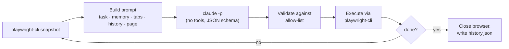

<div align="center">

# pw_agent

[](https://github.com/locle97/playwright-agent-loop/actions/workflows/ci.yml)


A [browser-use](https://github.com/browser-use/browser-use) style agent loop built on [`playwright-cli`](https://www.npmjs.com/package/@playwright/cli) and `claude -p`.

[Features](#features) • [Getting started](#getting-started) • [Usage](#usage) • [Regression tests](#turning-a-run-into-a-regression-test) • [How it works](#how-it-works) • [Roadmap](#roadmap) • [Development](#development)

</div>

Give it a task in plain English and `pw_agent` drives a real browser to finish it, one step at a time. The harness runs the loop, not the model: each step Claude sees the page and replies with a single structured decision. The harness checks that decision and runs it. Claude never gets a shell or any tools.

Every run also records the Playwright code behind each action, so a task the agent solved once can become a repeatable `@playwright/test` regression test.

An example run looks like this (illustrative output):

```console
$ python3 -m pw_agent "Go to example.com and report the page heading"
step 1 | Starting task | Open example.com | goto https://example.com → ok
step 2 | Page loaded | Read the heading | done success Example Domain → done
Result: success
Answer: Example Domain
Steps: 2  Cost: $0.0213
History: runs/20261003-101500-123456/history.json
```

## Features

- **The harness owns the loop**: snapshot, decide, validate, execute, record. The steps run in a fixed order and the browser is always closed at the end.
- **Structured decisions**: every step returns JSON that must match a schema: evaluation of the previous goal, memory, next goal, and 1 to 3 actions.
- **Commands go through an allow-list**: the decision schema restricts `cmd` to navigation and interaction commands and requires `done` to carry exactly two args, one of them `success` or `failure`. The harness checks again before running anything. Unknown commands and flags such as `--session` or `--filename` are rejected before they reach the browser.
- **Page content is treated as untrusted**: snapshots and tab titles are fenced and escaped, and the system prompt tells the model never to follow instructions found in them.
- **Built-in safeguards**: actions after a page-changing command are skipped, a `done success` is refused if an earlier action in the same step failed, repeated actions trigger a "try something different" nudge, and the run stops after repeated brain failures.
- **Full audit trail**: every run writes `history.json` with each decision, its results, and the total cost.
- **Replayable as a test**: each action in `history.json` carries the Playwright code `playwright-cli` ran for it, ready to paste into a regression test.
- **No Python dependencies**: the runtime uses only the standard library. `pytest` is needed only for tests.

## Getting started

### Prerequisites

- [Python](https://www.python.org/downloads/) 3.11 or later
- [Node.js](https://nodejs.org/) to install the Playwright CLI:
  ```bash
  npm i -g @playwright/cli@latest
  ```
- [Claude Code](https://docs.claude.com/en/docs/claude-code) (`claude`) on your `PATH` and logged in

> [!NOTE]
> The agent uses `prompts/playwright-cli.md`, a copy of the playwright-cli skill with the `find` and `eval` commands removed so the agent never tries them. The full skill in `.claude/skills/playwright-cli/` is for Claude Code. After updating it with `playwright-cli install --skills`, re-copy it to `prompts/playwright-cli.md` and remove `find` and `eval` again (`tests/test_main.py` checks this).

### Install

```bash
git clone https://github.com/locle97/playwright-agent-loop.git
cd playwright-agent-loop
pip install -e ".[dev]"   # optional: only needed for running tests
```

## Usage

Run from the repo root, because the default `--skill` path is relative to the current directory.

```bash
python3 -m pw_agent "<task>" [--max-steps N] [--model M] [--headed]
                             [--skill PATH] [--session NAME] [--state FILE]
                             [--allow-file-access] [--jev] [--jev-threshold FLOAT]
```

| Option | Default | Description |
| --- | --- | --- |
| `--max-steps` | `25` | Maximum number of loop iterations |
| `--model` | `sonnet` | Model passed to `claude -p --model` |
| `--headed` | off | Show the browser window |
| `--skill` | `prompts/playwright-cli.md` | Path to the playwright-cli skill appended to the system prompt |
| `--session` | `pw-agent` | playwright-cli session name |
| `--state` | none | Storage state JSON loaded with `playwright-cli state-load` before the first step, for pages that need a login |
| `--allow-file-access` | off | Allow `file://` URLs, which playwright-cli blocks by default |
| `--jev` | off | Experimental: route steps Jev is confident about to TypeSafe's Jev model instead of Claude. Needs `TYPESAFE_API_KEY` |
| `--jev-threshold` | `0.8` | Minimum Jev confidence (0 to 1) to accept its choice; lower-confidence steps go to Claude |

> [!IMPORTANT]
> Two runs at the same time must use different `--session` names. Otherwise they drive the same browser.

> [!WARNING]
> `--allow-file-access` gives the browser unrestricted access to local files, not just one file. A page that hijacks the agent could `goto file:///home/you/.ssh/...` and leak the contents. Only use it with trusted pages and trusted tasks. The flag only applies when the session's browser is first opened, so close any existing session first.

> [!WARNING]
> `--jev` sends the task, page snapshots and history to TypeSafe's API, including anything visible on authenticated pages. It needs `TYPESAFE_API_KEY` in the environment. It is experimental until the benchmark (`tests/bench`) passes.

### Authenticated pages

Log in once in a headed session and save the storage state (cookies and localStorage), then pass it with `--state`:

```bash
playwright-cli -s=login open https://app.example.com/login --headed
# log in by hand in the browser window, then:
playwright-cli -s=login state-save auth.json
playwright-cli -s=login close

python3 -m pw_agent "Open https://app.example.com/settings and report my plan" --state auth.json
```

> [!CAUTION]
> `auth.json` holds live session tokens. Keep it out of git, and remember the agent can act as you on every site in the file.

### Output

Each step's history line is printed as it happens, followed by the result, answer, step count, and cost. Each run gets its own directory, `runs/<timestamp>-<microseconds>/`, which contains:

- `snapshot.yml`: the latest accessibility snapshot of the page
- `history.json`: the task, the outcome, the total cost, and every step's decision and results. Each action also records the Playwright `code` that `playwright-cli` ran for it (`null` when the action was rejected, skipped, failed, timed out, was `done`, or printed no code; a timed-out `goto` may still have navigated).

> [!CAUTION]
> `code` contains whatever the agent typed, passwords included. Treat `history.json` like `auth.json`.

### Exit codes

| Code | Meaning |
| --- | --- |
| `0` | The agent finished with `done success` |
| `1` | Failure: `done failure`, max steps reached, repeated brain failures, or a playwright error |
| `2` | A preflight check failed: missing `prompts/system.md`, skill, `--state` file, `claude`, or `playwright-cli` |
| `130` | Interrupted with Ctrl-C (`history.json` is still written) |

## Turning a run into a regression test

A successful run already contains the steps of a Node.js `@playwright/test` test, so you don't need to drive the agent again:

1. Read `history.json` in step order and collect each action's `code`, skipping `null`. The code uses the semantic locators `playwright-cli` generates:
   ```js
   await page.goto('https://example.com/form');
   await page.getByRole('textbox', { name: 'Name' }).fill('Linh');
   await page.getByRole('button', { name: 'Submit' }).click();
   ```
2. Add assertions for the outcome the run reported in `answer`:
   ```js
   await expect(page.getByRole('heading')).toHaveText('Hello, Linh!');
   ```
3. Run it with `npx playwright test` and fix any locator that fails. [`test-generation.md`](.claude/skills/playwright-cli/references/test-generation.md) in the playwright-cli skill covers that workflow.

> [!IMPORTANT]
> Some setup leaves no `code` behind. If the run used `--state FILE`, load the same state in the test with `test.use({ storageState: 'auth.json' })`. If it used `tab-new`, `tab-select` or `tab-close`, edit the code by hand, because it assumes a single `page`.

## How it works



1. **Observe**: the harness lists the open tabs and takes an accessibility snapshot. Snapshots longer than 40k characters are truncated.
2. **Decide**: `claude -p` runs with all tools, MCP servers, and slash commands disabled. It gets [`prompts/system.md`](prompts/system.md) plus the playwright-cli skill as its system prompt and must return output that matches the decision schema.
3. **Validate and execute**: each action is checked against the allowed commands (`goto`, `click`, `fill`, `type`, `press`, `select`, `check`, `uncheck`, `hover`, `drag`, `tab-new`, `tab-select`, `tab-close`, `go-back`, `screenshot`, `done`) and their allowed flags, then run through `playwright-cli`. Actions after a page-changing command are skipped, because element refs may no longer be valid.
4. **Record**: the step is added to the history as one compact line, together with the Playwright code each action ran. The last 15 lines are included in the next prompt; the code is not.

The loop ends when the model sends a `done` action, when max steps is reached, or after 3 consecutive brain failures.

| Module | Responsibility |
| --- | --- |
| [`loop.py`](pw_agent/loop.py) | The agent loop, repeat detection, and failure handling |
| [`brain.py`](pw_agent/brain.py) | Calls `claude -p`, enforces the decision schema, tracks cost |
| [`actions.py`](pw_agent/actions.py) | Command and flag allow-lists, action execution, Playwright code capture |
| [`observe.py`](pw_agent/observe.py) | Tab list and page snapshot |
| [`prompt.py`](pw_agent/prompt.py) | Prompt sections, history lines, escaping untrusted content |
| [`pw.py`](pw_agent/pw.py) | `playwright-cli` wrapper |

## Roadmap

Planned work, in no particular order. Nothing here is scheduled yet.

**Test generation**

- [ ] **Automatic test export**: `python3 -m pw_agent export runs/<id>` writes a ready-to-run `.spec.ts` from `history.json`, replacing the manual [regression test](#turning-a-run-into-a-regression-test) steps.
- [ ] **Agent-recorded assertions**: an `expect` action, so the checks the agent makes become `expect(...)` lines instead of being written by hand from `answer`.
- [ ] **Multi-tab and storage state in exports**: generate code for `tab-*` commands and `--state` runs, the two cases that currently need hand edits.

**Reliability and cost**

- [ ] **Replay mode**: re-run the recorded code first and call the agent only when a step breaks, so a changed locator heals itself.
- [ ] **Cost budget**: a `--max-cost` limit that stops the run once spend exceeds it, alongside `--max-steps`.
- [x] **Jev backend (`--jev`, experimental until the benchmark passes)**: a cheaper brain using [TypeSafe's Jev](https://typesafe.ai/) model. Jev returns typed choices with calibrated confidence but no free text. So it picks the command and the element ref each step, and passes anything that needs text (URLs, form input, the final answer) or has low confidence to Claude.

**Safety**

- [ ] **Secret redaction**: mask passwords and other sensitive input in `history.json`, so it no longer has to be handled like `auth.json`.
- [ ] **Domain allow-list**: restrict `goto` and navigation to approved hosts.

**Experience**

- [ ] **TUI**: an interactive terminal UI that shows each step's goal, actions, results, and running cost live, with keys to pause, step through, or stop the run.
- [ ] **Batch runs**: run many tasks from a file, each in its own session.
- [ ] **Packaging**: a console-script entry point and a PyPI release, so `pw_agent` runs from any directory.

## Development

```bash
python3 -m pytest                                          # unit tests
PW_AGENT_E2E=1 python3 -m pytest tests/test_e2e.py -v -s   # live e2e: real claude + headless browser
```

> [!TIP]
> The e2e test fills in and submits [`tests/fixtures/form.html`](tests/fixtures/form.html) using a real model, so each run costs a small amount.

CI runs the unit tests on Python 3.11, 3.12, and 3.13 for every push to `main` and every pull request.
