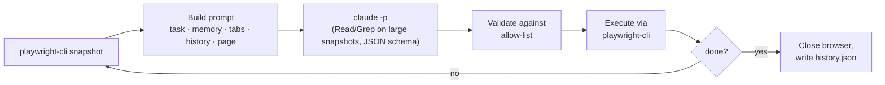

<div align="center">

# 🦆 Duckwright

[](https://github.com/locle97/duckwright/blob/main/LICENSE)
[](https://github.com/locle97/duckwright/actions/workflows/ci.yml)


**The rubber duck that drives your browser, then writes the regression test.**

A [browser-use](https://github.com/browser-use/browser-use) style agent loop built on [`playwright-cli`](https://www.npmjs.com/package/@playwright/cli) and `claude -p`.

[Features](#features) • [Getting started](#getting-started) • [Usage](#usage) • [Regression tests](#turning-a-run-into-a-regression-test) • [How it works](#how-it-works) • [Roadmap](#roadmap) • [Development](#development) • [License](#license)

</div>

Give it a task in plain English and Duckwright drives a real browser to finish it, one step at a time. The harness runs the loop, not the model: each step Claude sees the page and replies with a single structured decision. The harness checks that decision and runs it. Claude never gets a shell. Small pages are pasted into the prompt and Claude gets no tools. For larger pages its only tools are Read and Grep, limited to the folder that holds the page snapshot.

Every run also records the Playwright code behind each action, so a task the agent solved once can become a repeatable `@playwright/test` regression test.

An example run looks like this (illustrative output):

```console
$ duckwright -p "Go to example.com and report the page heading"
step 1 | Starting task | Open example.com | goto https://example.com → ok
step 2 | Page loaded | Read the heading | done success Example Domain → done
Result: success
Answer: Example Domain
Steps: 2  Cost: $0.0213
History: runs/20261003-101500-brave-otter/history.json
```

## Features

- **The harness owns the loop**: snapshot, decide, validate, execute, record. The steps run in a fixed order and the browser is always closed at the end.
- **Structured decisions**: every step returns JSON that must match a schema: evaluation of the previous goal, memory, next goal, and 1 to 3 actions.
- **Commands go through an allow-list**: the decision schema restricts `cmd` to navigation and interaction commands and requires `done` to carry exactly two args, one of them `success` or `failure`. The harness checks again before running anything. Unknown commands and flags such as `--session` or `--filename` are rejected before they reach the browser.
- **Page content is treated as untrusted**: snapshots and tab titles are fenced and escaped, and the system prompt tells the model never to follow instructions found in them, including in what it reads from `snapshot.yml`.
- **Large snapshots are searched, not pasted**: by default a page snapshot of up to 5,000 characters is pasted into the prompt. A larger one is saved to a file that Claude greps for what it needs, instead of receiving up to 40k characters. `--snapshot-full` and `--snapshot-grep` force one way or the other.
- **Built-in safeguards**: actions after a page-changing command are skipped, a `done success` is refused if an earlier action in the same step failed, repeated actions trigger a "try something different" nudge, and the run stops after repeated brain failures.
- **Full audit trail**: every run writes `history.json` with each decision, its results, and the total cost.
- **Replayable as a test**: each action in `history.json` carries the Playwright code `playwright-cli` ran for it, exported as a regression test with `duckwright export`.
- **Recorded assertions**: before finishing, the agent checks the outcome with `expect` actions. The harness verifies each check against the live page and records the passing ones as `expect(...)` lines.
- **API assertions**: with network capture on, the agent can also check the calls its last step made with `expect-request`: method, path or URL, and status, optionally a field of the JSON response. The harness verifies it against the captured traffic and exports it as a `page.waitForResponse(...)` check.
- **Direct API calls for setup**: with network capture on, the agent can call an endpoint it has already seen (same origin, the session's cookies) with a `request` action to seed data faster than the UI. The harness only sends a method and path it captured earlier, never follows redirects, and returns the status with a redacted excerpt. `duckwright export` replays it as a `page.request.fetch(...)` setup call, and refuses a run where one comes after a UI action other than `goto`.
- **Plan mode**: `duckwright plan docs/qa-plan.md` has Claude split a written test plan into one task file per scenario, with the shared setup in its own file. The TUI lists them under the plan to review, reorder, edit, and then run in parallel up to `--max-parallel`.
- **Web mode**: `duckwright --web` serves the same workspace as the TUI in a browser, in a shadcn-style UI: task list, plans, past runs, a live timeline of every step with its network calls, pause/step/stop, options, editing, and 2FA prompts. It listens on `127.0.0.1` only, behind a random per-launch token.
- **Two-factor verification**: the agent can get past a 2FA prompt with a `twofa` action. TOTP codes are generated from a secret you supply in `DUCKWRIGHT_TOTP_SECRET`; without it, and for SMS and email codes and passkey approvals, the run pauses and asks you (you type the current authenticator code when asked), with `-p`, in the TUI and in the web UI. Codes and the secret never reach `history.json`, the prompts or an exported test.
- **Minimal dependencies**: the core loop uses only Node's standard library; the TUI uses Ink; `@playwright/test` is a runtime dependency, used for spec replay; the web UI is built with React and Vite, which are development dependencies. TypeScript and the test tools are development dependencies.

## Getting started

### Prerequisites

- [Node.js](https://nodejs.org/) 22.18 or later, which also installs the Playwright CLI:
  ```bash
  npm i -g @playwright/cli@latest
  ```
- [Claude Code](https://docs.claude.com/en/docs/claude-code) (`claude`) on your `PATH` and logged in. The default `--snapshot-hybrid` mode and `--snapshot-grep` need a version with the `--restricted` option (tested with 2.1.288); `--snapshot-full` also works with older versions

> [!NOTE]
> The agent uses `prompts/playwright-cli.md`, a copy of the playwright-cli skill with the `find` and `eval` commands removed so the agent never tries them. The full skill in `.claude/skills/playwright-cli/` is for Claude Code. After updating it with `playwright-cli install --skills`, re-copy it to `prompts/playwright-cli.md` and remove `find` and `eval` again (`test/cli.test.ts` checks this).

### Install

Each option puts a `duckwright` command on your `PATH` that works from any directory.

**From npm**:

```bash
npm install -g duckwright
```

**From a clone**:

```bash
git clone https://github.com/locle97/duckwright.git
cd duckwright
npm install                              # also builds dist/
npm install -g .
```

**From a tarball you build yourself**, for example to copy to another machine:

```bash
npm install
npm pack                                 # writes duckwright-0.1.0.tgz
bash scripts/smoke_install.sh            # optional: install check in a temporary prefix, prints "smoke ok"
npm install -g ./duckwright-0.1.0.tgz
```

Installing straight from GitHub (`npm install -g github:locle97/duckwright`) does not work: npm builds git dependencies in a nested install that does not get the package's devDependencies, so the build fails with `tsc: not found`.

Check the install with `duckwright --version`. To pick up a newer version, re-run the same install command. To work on the code instead, see [Development](#development).

> [!NOTE]
> **Upgrading from the Python version**: Duckwright was rewritten in TypeScript; the commands, task files and `history.json` are unchanged. If you installed it with pipx, remove that copy first with `pipx uninstall duckwright`.

> [!NOTE]
> **Upgrading from `pw_agent`**: the project was renamed from `pw_agent` / `playwright-agent-loop` to Duckwright. If you installed the old version, replace it with:
> ```bash
> pipx uninstall playwright-agent-loop && npm install -g duckwright
> ```

## Usage

```bash
duckwright [--max-parallel N] [--past N] [--theme NAME] [--web [--port PORT]] [options]
duckwright ["<task>" | -f FILE|FOLDER ...] [options]
duckwright -p "<task>" [--max-steps N] [--model M] [--[no-]headed]
                  [--skill PATH] [--session NAME] [--state FILE] [--env ENV]
                  [--allow-file-access] [--[no-]network]
                  [--[no-]jev] [--jev-threshold FLOAT]
                  [--debug | --no-debug]
duckwright -p -f FILE|FOLDER [FILE|FOLDER ...] [options]
duckwright plan PLAN [-p] [options]
duckwright export [--api] RUN [-o FILE]
duckwright init
```

`duckwright` on its own opens the [interactive TUI](#interactive-tui). With `--web` it serves the [web UI](#web-mode) instead. Given a task or `-f`, it opens the TUI (or the web UI with `--web`) and starts them right away. `-p` (`--print`) skips the TUI: it runs the task, prints the report and exits, which is the mode for scripts and CI. With no terminal (stdin or stdout redirected), Duckwright always runs in print mode, as if `-p` were given, and the TUI options are ignored.

Run `duckwright --version` to print the installed version. Runs are written to `runs/` in the current directory, which is created if it does not exist.

| Option | Default | Description |
| --- | --- | --- |
| `-p`, `--print` | off | Run the task, print the report and exit, without the [TUI](#interactive-tui). Used automatically when there is no terminal |
| `-f`, `--file` | none | Read the task, and optional settings, from a [task file](#task-files) instead of the command line. Takes one or more files or folders; several make a [batch](#batch-runs) |
| `--plan` | none | [Plan mode](#plan-mode): split a test plan file into task files and list them in the TUI, or open a planned folder again. With `-p`, only write the task files. `duckwright plan PLAN` is the same |
| `--max-steps` | `25` | Maximum number of loop iterations |
| `--model` | `sonnet` | Model passed to `claude -p --model` |
| `--headed` | off | Show the browser window (`--no-headed` overrides a task file) |
| `--video` | off | Record one video of the whole run to `runs/<id>/video.webm` (`--no-video` overrides a task file). See [Evidence](#evidence-screenshots-and-video) |
| `--screenshot` | off | Save a screenshot of the page after every step to `runs/<id>/screenshots/` (`--no-screenshot` overrides a task file). See [Evidence](#evidence-screenshots-and-video) |
| `--skill` | bundled `prompts/playwright-cli.md` | Path to the playwright-cli skill appended to the system prompt |
| `--session` | `duckwright` | playwright-cli session name |
| `--state` | none | Storage state JSON loaded with `playwright-cli state-load` before the first step, for pages that need a login |
| `--env` | none | Environment context: the text of `environments/ENV.md` (or of the `.md` file at path ENV) is put into every step's prompt; `none` = no environment (see [Environment context](#environment-context)) |
| `--allow-file-access` | off | Allow `file://` URLs, which playwright-cli blocks by default |
| `--network` | on | Record the API calls the page makes each step, redacted, under `runs/<id>/network/` (see [Output](#output)); `--no-network` turns it off or overrides a task file |
| `--twofa-timeout` | `300` | Seconds (at most `2147483`) to wait for a person to type a 2FA code or approve a passkey before that `twofa` step fails (see [Two-factor verification](#two-factor-verification)) |
| `--jev` | off | Let TypeSafe's Jev model pick the command and element for simple steps and leave text and low-confidence steps to Claude (`--no-jev` overrides a task file or config). Needs `TYPESAFE_API_KEY`. Sends page data to TypeSafe, see the [warning](#jev-warning). Available but experimental: savings are not benchmarked yet |
| `--jev-threshold` | `0.8` | Minimum confidence (greater than 0, at most 1) for Jev's choice to be used instead of Claude's |
| `--debug` | off | Log every prompt sent to Claude and Jev, the raw responses, tokens, cost and timing to `runs/<id>/debug.log`, and with `-p` also to stderr (`--no-debug` overrides a task file or config). The log holds full page snapshots; credentials are redacted. See [Debug mode](#debug-mode) |
| `--max-parallel` | `3` | TUI and web: how many runs may be active at once; tasks given on the command line past the limit start as earlier runs finish. An error with `-p` |
| `--past` | `20` | TUI and web: how many of the newest past runs from `runs/` to show in the sidebar; `0` shows none. An error with `-p` |
| `--theme` | `auto` | TUI and web: the colour theme: `auto`, `dark`, or `light`. An error with `-p` |
| `--web` | off | Serve the [web UI](#web-mode) instead of opening the TUI. Cannot be used with `-p` |
| `--port` | free port | Web UI: the port to listen on. An error without `--web` |
| `--snapshot-hybrid` | on | Paste page snapshots of up to 5,000 characters into the prompt; for larger ones, let Claude grep the saved file. Decided again every step (see [Reading the page](#reading-the-page)) |
| `--snapshot-full` | off | Always paste the page snapshot into the prompt, truncated at 40k characters. Claude gets no tools |
| `--snapshot-grep` | off | Never paste the page snapshot: Claude always greps the saved file |

> [!NOTE]
> When the first argument is exactly `export` or `init`, it is read as that subcommand. Any longer task, such as `"export my report"`, runs normally; to run a task that is only the word `export`, write `duckwright -- export`.

> [!IMPORTANT]
> Two runs at the same time must use different `--session` names. Otherwise they drive the same browser. The same goes for two TUIs: give each its own `--session`. Inside one TUI, runs get their own sessions automatically.

> [!WARNING]
> `--allow-file-access` gives the browser unrestricted access to local files, not just one file. A page that hijacks the agent could `goto file:///home/you/.ssh/...` and leak the contents. Only use it with trusted pages and trusted tasks. The flag only applies when the session's browser is first opened, so close any existing session first.

<a id="jev-warning"></a>

> [!WARNING]
> `--jev` sends the task, every page snapshot it routes, and the step history to TypeSafe's API (`api.typesafe.ai`), including anything visible on logged-in pages. Only use it where that is acceptable.

### Interactive TUI

`duckwright` opens a workspace in the terminal. You queue tasks, start several at once, and watch each step's goal, actions, results, and running cost live. Pass the usual options (`--model`, `--max-steps`, ...) as defaults for every task, and `--max-parallel N` to cap concurrent runs.

A task or `-f` on the command line is added to the task list and started as soon as the TUI opens, up to `--max-parallel` at once, with the rest starting in order as runs finish: `duckwright -f tasks/` runs a whole folder in the TUI. A missing or invalid file is reported before the TUI opens (exit `2`). When you quit, the TUI prints the same kind of summary as a [batch run](#batch-runs).

**Global options.** The lower pane of the left column shows the global options (model, max steps, headed, snapshot mode, video, screenshot, jev, environment). `h` or `l` moves the focus between it and the task list; there, `j`/`k` pick a field and `⏎` edits it in place (`O` edits them from anywhere). They apply to every task's next run, above the command-line flags and below a task's own `o` options.

**Past runs.** Runs saved in `runs/` are listed on the sidebar's History tab, newest `--past N` of them (default 20); press `tab` to switch between Tasks and History. Each tab keeps its own selection and filter. Past runs are read-only: select one to see its timeline, and press `space` to run it again with the current flags, which moves it to the Tasks tab.

**Network calls.** With network capture on (the default), expand a step (`⏎`, or `e` for all steps) to see the calls it made: method, URL, status and time, with failures in red. A step lists up to 8 calls, then `…and N more`. The full request and response files stay under `runs/<id>/network/`.

**Filter.** Press `/` and type to narrow the sidebar by task name. `⏎` keeps the filter, `esc` clears it.

**Themes.** `--theme auto` picks dark or light from `COLORFGBG`; `COLORTERM=truecolor` enables the full-colour palette. With `NO_COLOR` set, no colours are used and the focused pane gets a bold border instead.

Keys to learn first:

| Key | Does |
| --- | --- |
| `i` | Add a task (`a` works too) |
| `tab` | Switch between the Tasks and History tabs |
| `P` | [Plan](#plan-mode) a test plan file |
| `space` | Start the selected task (on a plan's row: run the plan) |
| `⏎` | Show the selected task's details |
| `p` | Pause or resume it |
| `s` | Stop it |
| `R` | Open the selected run's spec in the Playwright Inspector |
| `q` | Quit (asks first if runs are active) |

Press `?` inside the TUI for the rest.

In the add box, `@` mentions task files: `@tasks/login.md` adds that file, and `@tasks/smoke/` adds every task file at the folder's root. Their front matter applies, as with `-f`, except `session:`, because each run gets its own browser session. Any text left over becomes one typed task:

```text
› @tasks/smoke/ @tasks/login.md Check the footer links
```

A completion list opens as you type after `@`. `tab` completes (going into a folder), and `⏎` accepts. Write a path with spaces as `@"my tasks/a.md"`, and `\@` for a literal `@`. If any mention fails (a missing file, a folder with no task files, bad front matter), nothing from that line is added and the errors show under the box.

### Web mode

`duckwright --web` starts a local server and opens the workspace in your browser:

```bash
duckwright --web                       # a free port; the URL is printed
duckwright --web --port 4173 -f tasks/ # run a folder of tasks, watch them in the browser
```

It does what the TUI does: queue typed tasks and `@` task files, plan a test plan file, start several runs at once (up to `--max-parallel`), pause, step and stop them, edit task files, set global and per-task options, answer 2FA prompts, and browse past runs. The sidebar has the TUI's two tabs, Tasks and History (past runs, newest `--past N`); click a tab or press `t` to switch (the TUI uses `tab`, which the browser keeps for moving focus). Each tab keeps its own selection and filter, and running a past run again moves it to Tasks. `i` adds a task (`a` works too). Press `?` for the keyboard shortcuts, which are like the TUI's with a few differences: `x` removes a task or plan (the TUI uses `d`), `p` pauses or resumes (the TUI has `p` and `r`), `E` and `C` expand and collapse all steps (the TUI uses `e` and `c`; in the web UI `e` edits), and the TUI-only `g`, `r`, `R`, `h`/`l`, `J`/`K` and `F` have no key. A task's card has a **Replay spec** button that does what `R` does in the TUI.

Like the TUI, `--web` needs `claude` and `playwright-cli` on your `PATH`; without them it exits with `2` before the server starts. A browser opened mid-run shows every run's steps since the server started.

The server is a local tool that can start browsers and read and write your task files, so it is locked down: it listens on `127.0.0.1` only (there is no option to change that), every request needs the random token from the printed URL (kept in a cookie after the first visit), a request with another `Host` is refused, and so is a request that changes something (POST, PUT or DELETE) with another `Origin`, and request bodies are capped at 1 MiB. Closing the tab does not stop the runs; `q`, the Quit button or Ctrl-C in the terminal stops them all, prints the batch summary and exits.

The web UI is built with Vite when the package is built (`npm run build`); a clone must be built before `--web` works.

### Plan mode

Plan mode turns a test plan you wrote, such as a QA plan with environment setup, test data, and numbered scenarios like [this one](docs/superpowers/test-plans/2026-10-06-network-capture-redacted-history-test-plan.md), into tasks you review in the TUI and run one after another.

```bash
duckwright plan docs/qa-plan.md      # or: duckwright --plan docs/qa-plan.md
```

Or press `P` in the TUI and `@` the plan file. A planner call (`claude -p`, no tools, with the run model) reads the plan and writes a folder of [task files](#task-files):

```text
tasks/qa-plan/
  01-login-works.md      one task per scenario, in the plan's order
  02-logout-works.md
  shared/setup.md        what every scenario does first in the browser (logging in, opening the app)
  plan.json              the plan's order, its notes, and the scenarios it skipped
```

- Each task file keeps its scenario's preconditions, steps, and expected results, and names the shared setup with `setup: shared/setup.md` in its front matter. The setup's text is put first in the task the agent gets, because every task runs in its own fresh browser.
- Setup a person must do, such as starting a server or loading test data with a script, is listed as notes under **Before you run**, since the agent only has a browser. Scenarios that need more than a browser (a shell, files, several processes) are not planned; they are listed with the reason.
- An existing folder is never overwritten: planning the same file again writes `tasks/qa-plan-2/`.

The plan shows in the task list as a row with its tasks under it, in run order. Nothing runs until you say so:

| Key | On the plan's row | On one of its tasks |
| --- | --- | --- |
| `⏎` | the plan: state, shared setup, notes, tasks, skipped scenarios | the task |
| `space` | run every task in order, up to `--max-parallel` at once | run just this task |
| `F` | run the failed and stopped tasks again, in order | the same, for its plan |
| `e` | edit the shared setup | edit the task file |
| `J` / `K` | | move the task down / up |
| `d` | remove the plan and its tasks from the list (the files stay) | remove the task from the plan |
| `s` | stop the plan run, or cancel planning | stop the task |
| `c` | fold or unfold the plan | the same, for its plan |

The editor opens the file as it is, front matter included: `⏎` starts a new line, `ctrl+s` saves, `esc` cancels. A file that no longer loads (a bad front-matter line, an empty task) is not saved, and the reason shows under the text. Moving and removing tasks is saved to `plan.json`, so `duckwright plan tasks/qa-plan/` (or `P` with `@tasks/qa-plan/`) opens the plan again as you left it, without planning it again.

With `-p`, `duckwright plan docs/qa-plan.md -p` only writes the task files and prints where they are, the notes and the skipped scenarios; run them later with `duckwright -p -f tasks/qa-plan/`. The folder's files run in name order there, which is the plan's original order.

### Authenticated pages

Log in once in a headed session and save the storage state (cookies and localStorage), then pass it with `--state`:

```bash
playwright-cli -s=login open https://app.example.com/login --headed
# log in by hand in the browser window, then:
playwright-cli -s=login state-save auth.json
playwright-cli -s=login close

duckwright "Open https://app.example.com/settings and report my plan" --state auth.json
```

> [!CAUTION]
> `auth.json` holds live session tokens. Keep it out of git, and remember the agent can act as you on every site in the file.

### Two-factor verification

When a login asks for a second factor, the agent uses a `twofa` action: the harness gets the code and types it, so the model never sees one.

| Kind | Where the code comes from |
|---|---|
| `totp` | Generated from your authenticator secret. Set it as `DUCKWRIGHT_TOTP_SECRET` (a base32 secret, or an `otpauth://` URI). If it is unset, Duckwright asks you to type the current 6-digit code from your authenticator app, like an SMS or email code, each time a `totp` step needs one (the code rotates every 30 seconds). It never asks for the secret. |
| `sms`, `email` | The run pauses and asks you for the code. |
| `passkey` | The run pauses until you approve the prompt on your device and confirm. |

```bash
export DUCKWRIGHT_TOTP_SECRET=JBSWY3DPEHPK3PXP
duckwright "Log in to the demo app as linh and open the dashboard"
```

- **With `-p` (print mode)** it asks on the terminal (prompts go to stderr). With no terminal (CI, a pipe) a step that needs a person fails at once with `no way to ask for a code`, and the agent can finish with `done failure`. `totp` still works unattended when `DUCKWRIGHT_TOTP_SECRET` is set; without it, `totp` needs a person like `sms` and `email`. In a batch the prompt names the task, for example `[2/3] tasks/b.md`.
- **The TUI** (the default on a terminal) shows a masked dialog and marks the waiting task with `?` in the list; the other runs keep going, and a second request waits its turn. `esc` cancels that step.
- **Waiting** is bounded by `--twofa-timeout` (default 300 seconds, at most 2147483; also a task-file key). Ctrl-C always stops the wait. A run may use at most 5 `twofa` actions.
- **Nothing is recorded by Duckwright**: the secret and every code are scrubbed from `history.json`, `events.jsonl`, `network/`, `page/snapshot.yml`, the prompts and the step lines it prints. The recorded Playwright code shows `[2FA CODE]`. Two things are outside that: the code you type for a TOTP, SMS or email prompt is echoed in your own terminal (so it stays in your scrollback), and playwright-cli keeps its own page snapshots in `.playwright-cli/` in the working folder, which can contain a code (codes expire) and are not part of Duckwright's run folder.
- **Short codes are masked everywhere**: a human code of only 4 digits is replaced wherever it appears, including in unrelated text such as a year.
- **An invalid `DUCKWRIGHT_TOTP_SECRET`** stops Duckwright before anything runs (exit `2`).
- **Exported tests**: a `totp` step becomes a `fill(totp())` that reads `DUCKWRIGHT_TOTP_SECRET` when the test runs, so the test works in CI. Tests exported from a run where you typed the codes still need `DUCKWRIGHT_TOTP_SECRET` set in CI. `sms`, `email` and `passkey` steps become `// MANUAL` steps with `await page.pause()`, and the export warns that the test cannot run unattended.

### Environment context

An environment file describes the system under test once, so task files do not repeat it: base URL, test accounts and where their credentials come from, seeded data, feature flags, known quirks, and what is off-limits. [`examples/environments/staging.md`](https://github.com/locle97/duckwright/blob/main/examples/environments/staging.md) is a template.

```bash
duckwright -p "Open the dashboard and report the plan name" --env staging
```

- **Folder and naming**: `--env staging` reads `environments/staging.md` in the current directory. A name is letters, digits, `.`, `_` and `-`, and does not start with `.`. A value with a `/` or ending in `.md` is a path to the file instead (`--env ../shared/staging.md`). `none` is reserved: it means no environment, so a file cannot be called `none`.
- **Where to set it**: `--env ENV` on the command line, `env:` in a task file's front matter, or `env:` in the [global config](#global-config). Precedence, lowest first: config, task file, command line. In a [batch](#batch-runs), `--env` on the command line applies to every task file and overrides each file's own `env:`. `--env none` (or `env: none`) switches off an environment set at a lower level. Choices made in the TUI or web sit on top of the command line.
- **Relative paths**: a path in a task file or the config resolves from that file's or the config's folder; a relative path given on the command line resolves from the current directory. A bare name always looks in `environments/` of the current directory.
- **Limits**: the file must be UTF-8 text (a BOM is allowed), not empty after trimming, and at most 16384 bytes. On the command line, preflight fails (exit `2`, before anything runs) with `environment file not found: PATH`, `environment file cannot be read: PATH: REASON`, `environment file too large: PATH is N bytes (limit 16384)`, or `environment file is empty: PATH`. In a batch the message is prefixed with the task file. In the TUI and web the task errors instead (an error toast; the web start request returns 409). If the file disappears after preflight, the run fails with exit `1` on the command line, and in the TUI and web it ends as failed with that message.
- **In the prompt**: the text is put in an `<environment>` section after `<task>` in every step's prompt, and the system prompt tells the agent to treat it as trusted background where the task wins on any disagreement.
- **History**: `history.json` records `"env": {"name": ..., "path": ...}` after `task_file` (never the text). With no environment there is no `env` key.
- **TUI and web**: in the TUI the `environment` field of the global Options pane (`O`) and of each task's `o` options form cycles through `none` and the files in `environments/` (`ctrl+r` goes back to inherited); the task detail shows an `environment` row. In the web UI the Options dialog has an `environment` select (inherit, `none`, each listed file), both globally (`O` or the options strip) and per task (`o` or the task's Options button), and the options strip shows an `env:` chip, marked ✱ when overridden; the effective environment is shown only on the global options strip, not per task. A global choice applies to every task's next run, a per-task one to that task, both above the command line.
- **Plan mode**: `duckwright plan PLAN --env ENV` writes `env: ENV` into every task file it creates (a path is written relative to the planned folder).
- **Never put raw secrets in it**: it goes into every prompt. Name where a credential comes from (an environment variable, or the `--state` file) instead of writing the value.

### Task files

A task can live in a file instead of on the command line, so you can keep it, review it and re-run it without shell quoting:

```bash
duckwright -f tasks/greet.md
```

The file is the task text, optionally preceded by front matter with the run's settings. `.txt`, `.md` and any other extension are read the same way:

```md
---
model: opus
max-steps: 15
state: auth.json
---
Open https://example.com/form, enter the name Linh, submit,
and check the greeting says "Hello, Linh!".
```

| Key | Value |
| --- | --- |
| `max-steps` | a whole number of at least 1 |
| `model` | text |
| `headed` | `true` or `false` |
| `skill` | a path |
| `session` | text |
| `state` | a path |
| `network` | `true` or `false` |
| `video` | `true` or `false` |
| `screenshot` | `true` or `false` |
| `twofa-timeout` | a whole number from 1 to 2147483 |
| `snapshot` | `hybrid`, `full` or `grep` |
| `jev` | `true` or `false` |
| `jev-threshold` | a number greater than 0 and at most 1 |
| `debug` | `true` or `false` |
| `setup` | a path: a file whose text is put before the task, for setup shared by several tasks (see [Plan mode](#plan-mode)) |
| `env` | an environment name, `none`, or a path to its file (see [Environment context](#environment-context)) |

- Front matter starts with `---` on the first line and ends at the next `---` line. Each line inside is a flat `key: value`; lines starting with `#` and text after ` #` are comments. Quote a value to keep a `#` in it.
- Flags on the command line override the file, for example `--max-steps 5`.
- Relative `skill`, `state`, `setup` and `env` paths are resolved from the file's folder, not the current directory.
- `allow-file-access` can only be given on the command line, so a shared task file can never turn it on.
- With `-p`, give either a task or `-f`, not both (the TUI takes both). A missing or invalid file prints the file, the line where there is one, and the problem, and exits with `2` before anything runs.

[`examples/task.md`](https://github.com/locle97/duckwright/blob/main/examples/task.md) is a commented template to copy.

#### Global config

Defaults shared by every run live in one per-user file, so you do not repeat flags on every command:

| System | File |
| --- | --- |
| Linux, macOS | `$XDG_CONFIG_HOME/duckwright/duckwright.conf`, or `~/.config/duckwright/duckwright.conf` when `XDG_CONFIG_HOME` is unset |
| Windows | `%APPDATA%\duckwright\duckwright.conf` (usually `C:\Users\<you>\AppData\Roaming\duckwright\duckwright.conf`) |

It is flat `key: value` lines (same comment rules as front matter) with the keys of the table above, minus `setup`, plus `max-parallel`, `past` and `theme` (the [options of the same names](#usage)). `duckwright init` writes a commented template there with every key at its default; it never overwrites an existing file.

```
model: opus
max-steps: 40
theme: dark
```

- Precedence, lowest first: built-in defaults, the config, a task file's front matter, flags on the command line.
- A missing file is fine. An invalid line prints `<file>:LINE: problem` and exits with `2` before anything runs.
- Relative `skill`, `state` and `env` paths are resolved from the folder holding the config.
- `allow-file-access` can only be given on the command line, as in task files.

#### Batch runs

Give `-p -f` several files, or a folder, to run them one after another and print a summary, as in scripts and CI (without `-p`, on a terminal, they open in the [TUI](#interactive-tui) instead):

```bash
duckwright -p -f tasks/login.md tasks/greet.md   # several files
duckwright -p -f tasks/*.md                       # shell glob
duckwright -p -f tasks/                           # every task file at the folder's root
duckwright -p -f tasks/ extra/one.md --headed     # mixed; flags apply to every task
```

- A folder runs its `.md` and `.txt` files (any case), sorted by name. Only the top level is read: subfolders, hidden files and other files, such as an `auth.json` next to the tasks, are ignored. A file reached twice runs once.
- Every file is loaded and preflight-checked before anything runs. If any is invalid, every problem is printed and nothing runs (exit `2`).
- Each task uses its own file's settings; flags on the command line apply to every task and still win.
- Tasks run in order, each in its own `runs/<id>/` folder, preceded by a `[1/3] tasks/a.md` line. A failing task does not stop the batch; Ctrl-C does, and the remaining tasks are not run.
- A summary follows the last task:

  ```
  Batch: 2 passed, 1 failed, 0 not run  Cost: $0.4120
  pass  tasks/a.md  $0.1467  runs/20261003-101500-a/history.json
  fail  tasks/b.md  $0.2121  runs/20261003-101530-b/history.json
  pass  tasks/c.md  $0.0532  runs/20261003-101612-c/history.json
  ```

  Each line is `pass`, `fail`, `stop` (interrupted) or `skip` (not run), then what that task cost and its `history.json`. The first line totals the cost of the whole batch, counting money spent by tasks that failed, crashed or were interrupted.
- When the paths come down to a single file, the run is an ordinary single run, with no summary.
- `-f` reads every argument after it as a path, so `duckwright -p -f a.md "Open the site"` fails with `Open the site: file not found`. A task on the command line and `-f` cannot be combined anyway.

### Output

Each step's history line is printed as it happens, followed by the result, answer, step count, and cost. Each run gets its own directory, `runs/<timestamp>-<label>/`, such as `runs/20261003-101500-login/`. The label is the task file's name without its extension (lowercased, accents dropped, anything but letters and digits turned into `-`, at most 40 characters), or two random words such as `brave-otter` for a task given on the command line or a file name with no usable characters. A run that would reuse an existing name gets `-2`, `-3` and so on. The directory contains:

- `page/snapshot.yml`: the latest accessibility snapshot of the page
- `history.json`: the task, the task file it came from (`task_file`, `null` for a task given on the command line), the outcome, the total cost, and every step's decision and results. Each action also records the Playwright `code` that `playwright-cli` ran for it (`null` when the action was rejected, skipped, failed, timed out, was `done`, or printed no code; a timed-out `goto` may still have navigated). For an `expect` action that passed, `code` is the assertion line, such as `await expect(page.getByText('Hello, Linh!')).toHaveText("Hello, Linh!");`.
- `network/<request id>/`: with network capture on (the default), one folder per captured API call, numbered `0001`, `0002`, … across the run. It holds `request.json` (id, step, method, redacted URL and headers), `response.json` (status, status text, type, MIME type, duration and redacted headers), and, only when non-empty, `request-body.txt` and `response-body.txt` (redacted) or `response-body.bin` (a binary response, copied unredacted). Nothing is created with `--no-network`.
- Per step, `history.json` also records `cost_usd` (what that step cost), `source` (`"claude"` or `"jev"`, who made the decision) and `jev` (`null` when Jev was not asked, else its `action`, `action_confidence`, `target`, `target_confidence` and `routed`: `accepted`, `needs_text`, `done`, `low_confidence`, or `error: <message>` when the Jev call failed and Claude took over). These per-step fields are present on every run. The top level always has `jev_steps` (0 without `--jev`) and `claude_steps`. With `--jev`, `-p` prints a `Jev steps: n/m` line, unless the run ended in an error.
- `events.jsonl`: every run event, one JSON object per line
- `screenshots/step-NNN.png`: with `--screenshot`, the page after each step (`step-001.png`, `step-002.png`, …). Each step in `history.json` gains a `screenshot` path relative to the run folder, or a `screenshot_error` message when the capture failed
- `video.webm`: with `--video`, one recording of the whole run. `history.json` gains a top-level `video` key (`"video.webm"`) when it was saved, and `-p` prints a `Video:` line with its path
- `debug.log`: with `--debug`, every prompt and response of the run (see [Debug mode](#debug-mode)). Not created otherwise
- `duckwright.spec.ts`: the generated regression test, written after every successful run

> [!CAUTION]
> `code` contains whatever the agent typed, passwords included. Treat `history.json` and any exported spec like `auth.json`. 2FA codes are the exception: they are replaced by `[2FA CODE]`.

> [!CAUTION]
> Redaction of captured network data is pattern-based (secret-named headers, secret-named keys in JSON, form and URL query data, and Bearer/Basic credentials). Captured bodies can still hold secrets it misses, and binary response bodies are not redacted at all. Treat `network/` like `history.json`.

### Debug mode

`--debug` (or `debug: true` in a task file or the config) writes everything a run sends to and gets back from Claude and Jev to `runs/<id>/debug.log`, and with `-p` also to stderr. It is for tuning prompts. Each Claude call is a block with the exact argv, the system prompt files, the full prompt with the size of each section, the raw response, token usage, cost and latency. With `--jev` you also get one block per Jev HTTP request and one per step saying why it went to Jev or Claude. A totals summary closes the run. With debug off, no file is written and `history.json` is unchanged.

```text
===== [debug 20261010-101500-login] step 3 · claude =====
argv: ["claude","-p","--model","sonnet", ...]
prompt sections:
  task                 212 chars  ~53 tokens (est.)
  page                4310 chars  ~1078 tokens (est.)
----- prompt (stdin) -----
...
----- response -----
...
----- usage -----
input tokens: 1520  output tokens: 94  cache read: 0  cache write: 0
cost: $0.0123  duration_ms: 4210  duration_api_ms: 3980
```

> [!CAUTION]
> `debug.log` contains full page snapshots. Credentials (the Jev API key, 2FA codes, secret-named headers and similar) are redacted, but page content is not. Treat it like `history.json` and do not share it from logged-in pages.

### Evidence: screenshots and video

`--video` and `--screenshot` (or `video: true` / `screenshot: true` in a task file's front matter or the config file) keep visual evidence of a run. Both are off by default. Command-line flags override the task file, which overrides the config file.

> [!CAUTION]
> Screenshots and video are not scrubbed. They show whatever the page shows, including typed passwords, 2FA codes and any other data on screen, because the 2FA scrubber cannot redact pixels. Leave them off unless you need them, and treat `screenshots/` and `video.webm` like `auth.json`.

The video follows the page that `playwright-cli` records, not other tabs that the agent opens. A failed screenshot or video never changes the run's outcome or exit code. In the TUI, the Options pane and each task's `o` form have `video` and `screenshot` fields, an expanded step shows a `shot` row with the file path, and the end banner shows a `video` row. In the web UI, the Options dialog has an Evidence group with both checkboxes, each step shows a thumbnail that opens full size in a dialog, and a finished run has a video player; past runs show the same.

**Network capture.** After each step that ran actions, Duckwright reads the page's requests through `playwright-cli`, redacts them in memory (secrets become a literal `[REDACTED]`), and writes them to `network/`. Each such step in `history.json` gains a `network` array of entries (`id`, `method`, `url`, `status`, `statusText`, `type`, `durationMs`), and, if something went wrong while capturing or clearing the request list, a `network_errors` array of messages. Steps where the brain failed have neither key. The next prompt shows the agent a short `<network>` summary of its last step's calls. Capture errors never change the run's outcome or exit code.

Limits:

- Only the current tab since its last page load is captured. Calls lost to a navigation in the middle of a step, or made in other tabs, are not recorded.
- If clearing the request list fails after a step, the next step may list the same calls again.
- A binary request body (an upload) is recorded as whatever `playwright-cli` prints for it, which may not be the real bytes.

### Exit codes

| Code | Meaning |
| --- | --- |
| `0` | The agent finished with `done success` |
| `1` | Failure: `done failure`, max steps reached, repeated brain failures, or a playwright error. In a batch, at least one task failed |
| `2` | Bad input or a preflight check failed: an unreadable or invalid task file, a folder with no task files, a missing system prompt, skill, `--state` file, `claude`, or `playwright-cli` |
| `130` | Interrupted with Ctrl-C (`history.json` is still written; a batch stops at the interrupted task) |

## Turning a run into a regression test

A successful run already contains the steps of a Node.js `@playwright/test` test, so you don't need to drive the agent again:

1. A successful run writes `duckwright.spec.ts` automatically. To export a run again, or elsewhere:
   ```bash
   duckwright export runs/<id>                      # writes runs/<id>/duckwright.spec.ts
   duckwright export runs/<id> -o e2e/greet.spec.ts # or anywhere else
   duckwright export --api runs/<id>                # API-only spec: runs/<id>/duckwright.api.spec.ts
   ```
   The test contains each action's recorded `code` in step order, including the assertions the agent checked with `expect`, using the semantic locators `playwright-cli` generates:
   ```ts
   // Generated by duckwright from history.json. Review before committing:
   // recorded code contains everything the agent typed, passwords included.
   import { test, expect } from '@playwright/test';

   test("Fill in the form with the name Linh and check the greeting", async ({ page }) => {
     await page.goto('https://example.com/form');
     await page.getByRole('textbox', { name: 'Name' }).fill('Linh');
     await page.getByRole('button', { name: 'Submit' }).click();
     await expect(page.getByText('Hello, Linh!')).toHaveText("Hello, Linh!");
   });
   ```
   An `expect-request` becomes a `page.waitForResponse(...)` that is armed at the start of the step that made the call, so the response promise exists before the request happens, and checked where the agent asserted it:
   ```ts
     const apiResponse1 = page.waitForResponse((r) => r.request().method() === "POST" && new URL(r.url()).pathname === "/api/login");
     await page.getByRole('button', { name: 'Sign in' }).click();
     expect((await apiResponse1).status()).toBe(201);
   ```
   `expect-request` checks only the calls from the step before it, takes a path or URL without a query string, and cannot assert a field that was redacted in the capture. The `waitForResponse` predicate includes the status (and the field value), so the test waits for the first response that satisfies them all, matching what the harness verified. Expected values in recorded assertions are always written in double quotes; that is intended. Screenshots are left out. If the agent recorded no assertions, the export prints a warning.

   A `request` is exported as a setup call, `page.request.fetch(...)` followed by a status check, in the order it ran. It is for setup only: the export refuses a run where a `request` comes after any interaction other than `goto`. The JSON body the agent sent is written into the call (re-serialised as JSON), so check it for secrets, as with `fill`. The call uses the test's own context, so for a run that used `--state` add `test.use({ storageState: 'auth.json' })` or the cookies will be missing. `request` cannot send headers (an endpoint that needs a CSRF header will not work), a query string, or a call to another origin.

   **API-only spec.** `duckwright export --api` replays the run's captured `fetch`/`xhr` calls with the `request` fixture and asserts each call's status, so the backend flow runs without the UI. It needs network capture. Only the `content-type` and `accept` headers are kept, and captured values are redacted, so the export warns wherever `[REDACTED]` appears; supply auth by hand, and for a `--state` run add `test.use({ storageState: 'auth.json' })`. It exits `1` when there are no captured API calls. A run itself still writes the UI spec only.
2. Add any further assertions the agent did not record.
3. Run it with `npx playwright test` and fix any locator that fails. To watch the spec step by step first, press `R` in the TUI or click **Replay spec** in the web UI. [`test-generation.md`](https://github.com/locle97/duckwright/blob/main/.claude/skills/playwright-cli/references/test-generation.md) in the playwright-cli skill covers that workflow.

**Replaying in the Playwright Inspector.** `R` (TUI) and **Replay spec** (web) run `playwright test duckwright.spec.ts --debug` in the run folder. Each run can have one replay open at a time. Playwright's output is discarded, so a non-zero exit shows only as a toast. It needs a display and Playwright's browser; run `npx playwright install chromium` if the close toast shows a non-zero exit.

Only successful runs can be exported. `duckwright export` exits with `0` when the test was written, `1` when it refused (the run did not succeed, or it recorded no Playwright code), and `2` when the path or `history.json` cannot be used. When a run exports its test automatically, a failed export is reported on stderr but does not change the run's exit code.

> [!IMPORTANT]
> Some setup leaves no `code` behind. If the run used `--state FILE`, load the same state in the test with `test.use({ storageState: 'auth.json' })`. If it used `tab-new`, `tab-select` or `tab-close`, the export marks the spot with a `// TODO(duckwright)` line and prints a warning: edit that part by hand, because the test assumes a single `page`.

## How it works



1. **Observe**: the harness lists the open tabs and saves an accessibility snapshot to `page/snapshot.yml`. The snapshot is then either pasted into the prompt or named there with its size for Claude to search; see [Reading the page](#reading-the-page).
2. **Decide**: when the snapshot is pasted, `claude -p` gets no tools. Otherwise it runs in the `page/` folder with only the Read and Grep tools and `--restricted`, which keeps them inside that folder. MCP servers and slash commands are always disabled. It gets [`prompts/system.md`](https://github.com/locle97/duckwright/blob/main/prompts/system.md), the prompt for its reading mode (`snapshot-hybrid.md`, `snapshot-full.md` or `snapshot-grep.md`), and the playwright-cli skill as its system prompt, and must return output that matches the decision schema.
3. **Validate and execute**: each action is checked against the allowed commands (`goto`, `click`, `fill`, `type`, `press`, `select`, `check`, `uncheck`, `hover`, `drag`, `tab-new`, `tab-select`, `tab-close`, `go-back`, `screenshot`, `expect`, `done`) and their allowed flags, then run through `playwright-cli`. `expect` is handled by the harness: it gets a locator for the ref with `playwright-cli generate-locator`, reads the element's state, and compares it with the expected value. Actions after a page-changing command are skipped, because element refs may no longer be valid.
4. **Record**: the step is added to the history as one compact line, together with the Playwright code each action ran. The last 15 lines are included in the next prompt; the code is not.

The loop ends when the model sends a `done` action, when max steps is reached, or after 3 consecutive brain failures.

| Module | Responsibility |
| --- | --- |
| [`loop.ts`](https://github.com/locle97/duckwright/blob/main/src/loop.ts) | The agent loop, repeat detection, and failure handling |
| [`brain.ts`](https://github.com/locle97/duckwright/blob/main/src/brain.ts) | Calls `claude -p`, enforces the decision schema, tracks cost |
| [`actions.ts`](https://github.com/locle97/duckwright/blob/main/src/actions.ts) | Command and flag allow-lists, action execution, Playwright code capture |
| [`export.ts`](https://github.com/locle97/duckwright/blob/main/src/export.ts) | Renders `history.json` as a `@playwright/test` spec |
| [`exportApi.ts`](https://github.com/locle97/duckwright/blob/main/src/exportApi.ts) | Renders captured API calls as a `request`-fixture spec (`export --api`) |
| [`expect.ts`](https://github.com/locle97/duckwright/blob/main/src/expect.ts) | `expect` checks: verified against the live page and recorded as assertions |
| [`expectRequest.ts`](https://github.com/locle97/duckwright/blob/main/src/expectRequest.ts) | `expect-request` checks: verified against the captured network calls and rendered as `waitForResponse` assertions |
| [`request.ts`](https://github.com/locle97/duckwright/blob/main/src/request.ts) | `request` action: argument checks, the seen-only gate, the fixed `run-code` call, response excerpt and the exported setup lines |
| [`config.ts`](https://github.com/locle97/duckwright/blob/main/src/config.ts) | Reads the per-user global config that sits under task-file settings and flags |
| [`taskfile.ts`](https://github.com/locle97/duckwright/blob/main/src/taskfile.ts) | Reads task files (front-matter settings, the shared setup and the task text) and expands task folders for batch runs |
| [`plan.ts`](https://github.com/locle97/duckwright/blob/main/src/plan.ts) | Plan mode: the planner call, its schema, and writing and reading planned folders |
| [`totp.ts`](https://github.com/locle97/duckwright/blob/main/src/totp.ts) | RFC 6238 one-time passwords from a user-supplied secret |
| [`twofa.ts`](https://github.com/locle97/duckwright/blob/main/src/twofa.ts) | The per-run 2FA provider: env secret, human prompts, timeout and attempt cap |
| [`scrub.ts`](https://github.com/locle97/duckwright/blob/main/src/scrub.ts) | Removes the secret and 2FA codes from everything a run keeps or sends |
| [`observe.ts`](https://github.com/locle97/duckwright/blob/main/src/observe.ts) | Tab list and page snapshot |
| [`prompt.ts`](https://github.com/locle97/duckwright/blob/main/src/prompt.ts) | Prompt sections, history lines, escaping untrusted content |
| [`pw.ts`](https://github.com/locle97/duckwright/blob/main/src/pw.ts) | `playwright-cli` wrapper |
| [`proc.ts`](https://github.com/locle97/duckwright/blob/main/src/proc.ts) | Runs `claude` and `playwright-cli` as child processes, with a timeout and Ctrl-C stopping them |
| [`cli.ts`](https://github.com/locle97/duckwright/blob/main/src/cli.ts) | The command line: single runs, batches, `export`, and `history.json` |

### Reading the page

There are three ways for Claude to read the page snapshot:

| Mode | Snapshot of up to 5,000 characters | Larger snapshot |
| --- | --- | --- |
| `--snapshot-hybrid` (default) | pasted, no tools | saved to `page/snapshot.yml`, Claude greps it |
| `--snapshot-full` | pasted, no tools | pasted, truncated at 40k characters |
| `--snapshot-grep` | saved, Claude greps it | saved, Claude greps it |

Pasting is cheapest for small pages: Claude answers in one model call. Grepping adds a model round trip per search, but on a large page it costs far less than pasting tens of thousands of characters every step. It also never loses the end of a page to truncation. Hybrid mode decides again every step, so a run can switch from one to the other as it moves between pages.

## Roadmap

Planned work, in no particular order. Nothing here is scheduled yet.

**Test generation**

- [x] **Automatic test export**: `duckwright export runs/<id>`, or any successful run, writes a ready-to-run `.spec.ts` from `history.json`, replacing the manual [regression test](#turning-a-run-into-a-regression-test) steps.
- [x] **Agent-recorded assertions**: an `expect` action, so the checks the agent makes become `expect(...)` lines instead of being written by hand from `answer`.
- [x] **Direct API requests**: a `request` action for fast test setup, replayed in exports as `page.request.fetch(...)`.
- [ ] **Multi-tab and storage state in exports**: generate code for `tab-*` commands and `--state` runs, the two cases that currently need hand edits.
- [ ] **Verified exports**: `duckwright verify runs/<id>`, run automatically after each run, runs the generated spec headless a few times and only reports success when every run passes, so a flaky or broken spec never counts as done.

**Reliability and cost**

- [X] **Replay mode**: re-run the recorded code first and call the agent only when a step breaks, so a changed locator heals itself.
- [ ] **Cost budget**: a `--max-cost` limit that stops the run once spend exceeds it, alongside `--max-steps`.
- [ ] **Wait for the page to settle**: wait for network and DOM activity to go quiet before each snapshot, so the agent never acts on a half-loaded page.
- [x] **Jev backend (`--jev`)**: a cheaper brain using [TypeSafe's Jev](https://typesafe.ai/) model. Jev returns typed choices with calibrated confidence but no free text, so it picked the command and the element ref each step, and anything that needs text (URLs, form input, the final answer) or had low confidence went to Claude. Savings not benchmarked yet.

**Safety**

- [ ] **Secret redaction**: mask passwords and other sensitive input in `history.json`, so it no longer has to be handled like `auth.json`.
- [ ] **Domain allow-list**: restrict `goto` and navigation to approved hosts.
- [ ] **Confirm risky actions**: `--confirm` pauses before clicks whose label matches words like delete, pay, submit order, or send, and waits for a y/n before running them.

**Authentication**

- [X] **Two-factor verification**: get past 2FA prompts during a run. TOTP codes are generated from a secret supplied by the user, or typed by the user when there is none (never recorded in `history.json`). SMS and email codes, and passkeys, pause the run and ask the user for the code or approval.

**Network and API testing**

- [x] **Network capture**: record the requests the page makes during each step (method, URL, status, and request and response bodies, via `playwright-cli requests`) into `history.json` and per-request files under `network/`, with secrets and auth headers redacted. The agent sees a short summary of the API calls its last actions triggered.
- [x] **API assertions**: an `expect-request` action, so the agent can check that a step called the expected endpoint with the expected status or response field. The harness verifies it against the captured traffic and exports it as a `page.waitForResponse(...)` check.
- [x] **API test export**: `duckwright export --api runs/<id>` turns the captured calls into a `@playwright/test` spec that uses the `request` fixture, so the backend flow can be tested without the UI.
- [X] **API steps in the loop**: a `request` action that lets the agent call an endpoint it has already seen on the site directly (same origin, current session cookies), for example to set up test data faster than through the UI.

**Experience**

- [x] **TUI**: an interactive terminal UI that shows each step's goal, actions, results, and running cost live, with keys to pause, step through, or stop the run.
- [x] **Batch runs**: `duckwright -f tasks/` (or several files) runs task files one after another and prints a summary.
- [x] **TUI by default**: running `duckwright` with no arguments opens the [TUI](#interactive-tui) directly, and the `--tui` flag goes away. The current one-shot CLI mode becomes `--print` / `-p`, as in Claude Code: `duckwright -p "<task>"` (or `-p -f tasks/login.md`) runs the task, prints the report, and exits, which is the mode to use in scripts and CI. The TUI-only options (`--max-parallel`, `--past`, `--theme`) then apply without a flag, and `--print` with no terminal is the supported non-interactive path.
- [x] **Web mode**: `duckwright --web` serves the TUI's workspace in a browser (React + Vite, shadcn-style), loopback only, with a per-launch token.
- [x] **Plan mode**: `duckwright plan <plan-file>` (or `--plan`) takes a plan written by the user, such as a QA test plan with environment setup, test data, and numbered scenarios like [this one](docs/superpowers/test-plans/2026-10-06-network-capture-redacted-history-test-plan.md). A planner agent (Claude) first breaks the plan into separate tasks and writes them as task files under `tasks/`, one per scenario, carrying over each scenario's preconditions, steps, and expected results and keeping shared setup out of the individual tasks. The tasks are then added to the TUI task list, where they can be reviewed, reordered, edited, or removed before running, and run one after another like a batch.
- [ ] **Parallel batches**: `-j N` runs up to N task files at once, giving each its own `--session` name automatically so they never share a browser.
- [ ] **HTML report**: a `report.html` next to each run's `history.json` with every step's goal, actions, results, screenshot, and cost, plus an index page for a batch.
- [ ] **Exploration mode**: `duckwright explore <url>` wanders a site with no fixed task and reports broken links, console errors, and dead-end flows. It can also write task files for the flows it finds.
- [ ] **MCP server**: `duckwright mcp` exposes Duckwright as an MCP server, so Claude Code and other agents can call it as a tool to run a task, a task file, or an export, and get back the result, the run's `history.json`, and the generated spec.
- [x] **Environment context**: a per-environment context file (for example `environments/staging.md`, chosen with `--env staging`) that is seeded into every task's prompt, so the agent starts each run knowing the basics of the environment under test: base URL, test accounts and where their credentials come from, seeded test data, feature flags, known quirks, and what is off-limits. Shared once instead of repeated in every task file, and never containing raw secrets (referenced by name, like `--state`).
- [x] **Packaging**: a `duckwright` command that runs from any directory after a local or GitHub install.
- [x] **npm release**: `npm install -g duckwright`, published from GitHub releases by `release.yml`.

## Development

```bash
git clone https://github.com/locle97/duckwright.git
cd duckwright
npm install
npm test                                                   # typecheck and unit tests
DUCKWRIGHT_E2E=1 node --test test/e2e.test.ts              # live e2e: real claude + headless browser
npm run build && DUCKWRIGHT_UI_SMOKE=1 node --test test/web/ui.smoke.test.ts   # browser smoke test of the web UI
node src/bin.ts "<task>"                                   # run from source, no build needed
```

Node runs the TypeScript sources directly, so tests and `node src/bin.ts` need no build step; `npm run build` writes `dist/` for the installed command. The web client lives in `web/` (React + Vite); `npm run build` builds it into `dist/web-ui/`, and `DUCKWRIGHT_UI_SMOKE=1 node --test test/web/ui.smoke.test.ts` runs the browser smoke test after a build.

> [!TIP]
> The e2e test fills in and submits [`test/fixtures/form.html`](https://github.com/locle97/duckwright/blob/main/test/fixtures/form.html) using a real model, so each run costs a small amount.

### Benchmark tasks

[`benchmark_tasks/`](https://github.com/locle97/duckwright/tree/main/benchmark_tasks) holds tasks on public demo sites. They are for comparing cost and reliability between settings, for example the three ways of [reading the page](#reading-the-page):

```bash
duckwright -p -f benchmark_tasks                 # --snapshot-hybrid (default)
duckwright -p -f benchmark_tasks --snapshot-full # always paste the snapshot
duckwright -p -f benchmark_tasks --snapshot-grep # always grep the snapshot
duckwright -p -f benchmark_tasks --jev           # Jev picks the simple steps (see 09-quotes-jev-clicks.md)
```

The `Batch:` summary line gives each run's total cost, and every task line its own cost. Each file's front-matter comments give the expected answer. The tasks range from a small to-do app to a long checkout flow and a Wikipedia article far larger than the 40k-character `--snapshot-full` limit. They read public sites, so an answer can drift if a site changes. Model costs also vary from run to run, so compare more than one run of each.

Every file at the top of the folder runs as a task, so keep notes out of it.

### Benchmark plans

[`benchmark_plans/`](https://github.com/locle97/duckwright/tree/main/benchmark_plans) holds four written test plans on public demo sites, for [plan mode](#plan-mode). Each is written in a different style, and most have shared setup, steps only a person can do, and a scenario that needs more than a browser. Its [README](benchmark_plans/README.md) lists the split each plan should give: the tasks, the shared setup, the notes and the skipped scenarios.

```bash
duckwright plan benchmark_plans/01-saucedemo-shop.md
```

CI runs the typecheck and unit tests on Node 22 and 24 for every push to `main` and every pull request, then builds the package and smoke-tests it in a temporary install prefix.

Releasing to npm: create a GitHub release with a new tag `vX.Y.Z` (Releases → Draft a new release → choose a new tag). `release.yml` sets `package.json` to that version, runs the tests and the install check, publishes to npm with provenance, then commits the version bump to `main`. A release marked as pre-release (e.g. `v0.2.0-beta.1`) is published under the `next` dist-tag and does not bump `main`.

## License

[MIT](https://github.com/locle97/duckwright/blob/main/LICENSE).

`prompts/playwright-cli.md` and `.claude/skills/playwright-cli/` are adapted from the skill shipped with Microsoft's [`@playwright/cli`](https://www.npmjs.com/package/@playwright/cli), which is licensed under Apache-2.0.

Duckwright is not affiliated with Microsoft or the Playwright project.
